[TOC]

[波浪理论的基础--五升三降](#波浪理论的基础--五升三降)

[推动浪及其变异型态](#推动浪及其变异型态)

[修正浪的变异型态](#修正浪的变异型态)

[理想化的艾略特波动序列](#理想化的艾略特波动序列)

[艾略特波浪进阶](#艾略特波浪进阶)

[波浪理论的游戏规则](#波浪理论的游戏规则)

[波浪理论的原理](#波浪理论的原理)

[波浪理论的几个基本要点](#波浪理论的几个基本要点)

[波浪理论的缺陷](#波浪理论的缺陷)

波浪理论是一种具有特殊价值的工具，具体表现在其普遍性及精确性。

说它具普遍性，是指我们可在许多有关人类活动的领域中运用到它，且许多时候有令人难以置信的效果；

说它具有精确性，是指在确认以及预测走势的变化上，其准确性令人叹为观止。这是其他分析方法所难望其项背的 。

当时，准确地说在美股见底之前的半个小时，艾略特就预言，在未来的几十年将会出现一个大多头市场。他的这项预言，与仍然弥漫着熊气的市场截然相反。其时大部分人都不敢想象道·琼斯工业平均指数会超越它在１９２９年所创下的最高点（３８６点）。但是，事实证明波浪理论是对的! 

#### 波浪理论的基础--五升三降

波浪理论认为：股票市场的发展遵循着五浪上升，三浪下降的基本型态，从而形成包含八浪的完整周期。 

前面五浪所组成的波浪是股市运行的主要方向，而后面三浪所组成的波浪是股市运行的次要方向（图）。 

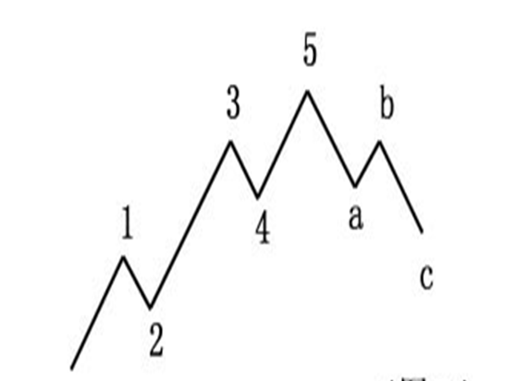

在这个完整的八浪周期结束之后，随之而来的是第二个类似的周期变动……，如此不断地重复。这样，较小级别一波浪总是包含在较大的波浪中，或者说：波浪理论认为，任一序列中，任一级次的浪，均可被细分以及再细分为较小级次的浪。但五升三降乃是其基础。 

由于波浪理论所描述的波浪“有界无限”（在实际应用中是有限的），所以，我们必须对每一级次的波浪作出标识，以及准确分析。习惯上，我们只关心所有级别中九个级别的波浪： 

**超级大循环浪、大循环浪、循环浪；         基本浪、中型浪、小型浪；　  细浪、微浪、次微浪。**

一般而言，超级大循环浪的运行时间往往会超过一个人的寿命。而细浪以下的更小级别的小波浪运行时间很少超过１小时。因此，在实际应用上，我们只关心这九个级次的波浪。 

超大循环浪（GrandSupercycle）：`<I>、<II>、<III>、<IV>、<V>，<A>、<B>、<C>；`

大循环浪（Supercycle）：（I）、（II）、（III）、（IV）、（V），（A）、（B）、（C）；　

循环浪（Cycle）：I、II、III、IV、V，A、B、C；  

基本浪（Primary）：（1）、（2）、（3）、（4）、（5），a、b、c；　　　　　　　

中型浪（Intermediate）：1、2、3、4、5，a、b、c；

小型浪（Minor）：(ⅰ)、(ⅱ)、(ⅲ)、(iv)、(v)，(a)、(b)、(c)； 

细浪（Minute）：ⅰ、ⅱ、ⅲ、iv、v，a、b、c；

微浪（Minuette）：1、2、3、4、5，(a)、(b)、(c)；　　　　　　　

次微浪（Subminuette）：ⅰ、ⅱ、ⅲ、iv、v，a、b、c； 

上述标记符号并不是唯一合法的，也可以使用其他的标记符号。值得注意的是，不宜使用“大”、“特大”、“一、二、三……”等字眼，它除了只会让人觉得你不够专业外，没有任何好处。 

波浪理论的“五升三降”看似简单，实则深奥。浪中有浪更是包含了丰富的哲理，与中国古代的“太极生两仪、两仪生四象、四象生八卦……”的含义多少有些类似。 

一名高瞻远瞩的投资者，他总是会注意到目前股市的走势在更广阔的范围内处在什么阶段。波浪理论恰好就是这样一种合适的工具，就像一副大倍数的望远镜一样，但是到了关键时刻，它又可变成一副显微镜，帮助投资者捕捉市场大逆转的转折点。 

我要提醒投资者，每一个波浪并不是相等的，它可以压缩，可以延长，可以简单，可以复杂。总之，一切以型态为准。 

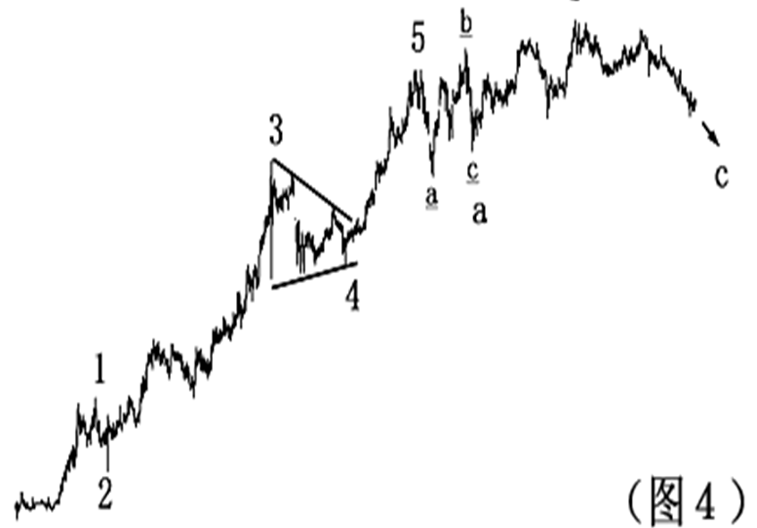

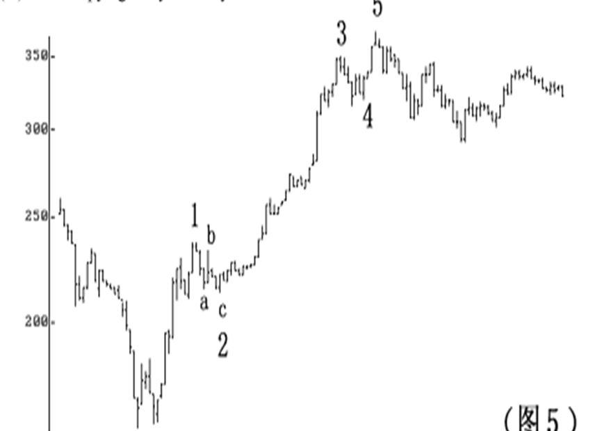

#### 推动浪及其变异型态

如果在你面前站着一只动物，你一定可以知道这是人或者是猫或是其他你所知道的动物，如果是一个人，你会知道他的哪部分与你不一样，但你会知道他是人。 

在艾略特波浪理论中，波浪的型态决定了其性质是推动浪还是修正浪。但是每一个浪的型态也不完全一样。 

在现实情况中，推动浪会因基本面的不同而出现一些变异型态。但以标准的推动浪来说，它们是五浪推动的，在牛市中是五浪上升，在熊市中是五浪下跌，五浪结束就会运行修正浪（见图１）。 

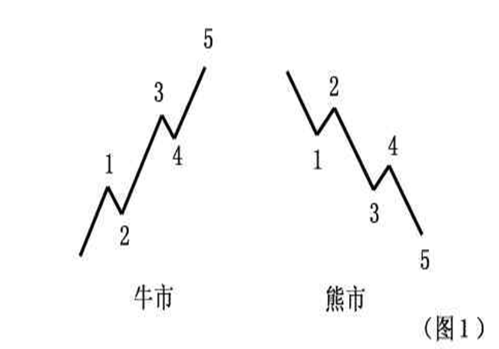

推动浪的变异型态则有数个种类。最初艾略特只提出了“浪的延伸”、“失败的第５浪”、“倾斜三角形”等类型。后来，又有人进一步指出，还有“第二种倾斜三角形”等形态。 

所谓浪的延伸，是指浪的运动发生放大或拉长的现象。当波浪发生延伸时，将会使得此一波浪序列形成大小相似的九浪，而如果延伸浪中再出现延伸，则我们会见到十三个大小相似的波浪。 

在现实中波浪的延伸是经常出现的，也许在未来，浪的延伸会被认为是推动浪的正常型态。如果在分析中无法辩认是哪一个波浪出现延伸，这不要紧。因为在艾略特的理论体系中，五浪、九浪与十三浪甚至十七浪的意义是一样的（见图２）。 

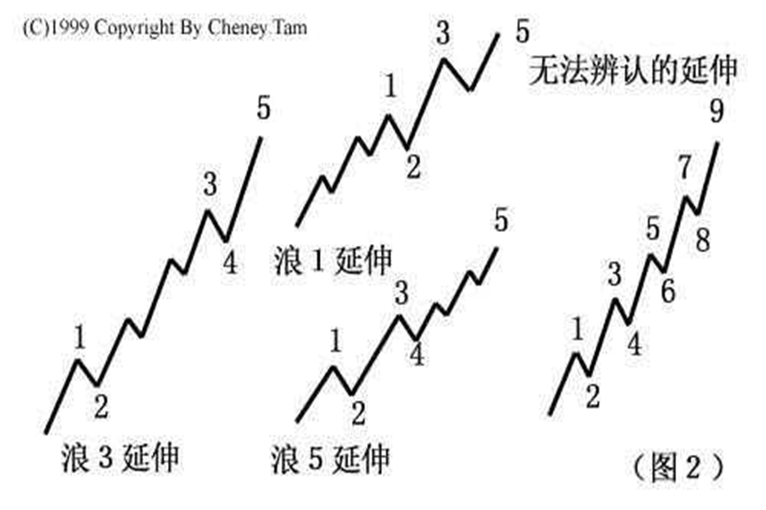

一般情况下，三个推动浪中有且仅有一个浪出现延伸。这个事实，使波浪的延伸现象变成了预测推动浪运行长度的一个相当有用的依据。 

举例来说，如果投资者发觉第３浪出现延伸时，那么第５浪理应只是一个和第１浪相似的简单结构。或者，当第１浪与第３浪都是简单的升浪，则有理由相信第５浪可能是一个延伸浪，特别是当成交量急剧增加时。请注意，在成熟的股市，延伸浪经常会出现在第３浪中；而在新兴股市中，第５浪往往也出现延伸的现象。 

推动浪可以延伸，也可以失败。艾略特使用“失败型态”的字眼，藉以描述第５浪的运动未能突破第３浪终点的价格水平。也有人使用“未完成的第５浪”这个词表达上述意思（见图３）。 

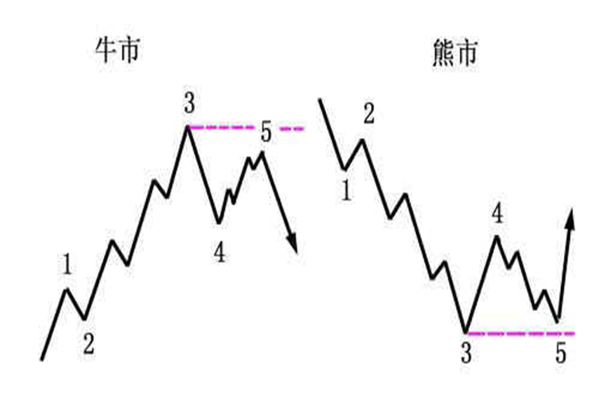

如果不使用“失败的”这个词，则不如使用“未创新高(低)的”。因为“未完成的”很容易让人误以为第５浪尚未结束。当第５浪不能创新高（低）时，很可能市场会出现大逆转。 

其包含的深层意义，并非在此三言两语所能说得清楚。要特别提醒读者的是，在实战应用中一定要注意第５浪中的次一级５个小浪清晰出现后才可确认此“失败５浪”。 

否则，可以演变成“４浪ｂ”，只要它是３浪运行的。“失败的第５浪”的出现，大多数情况下是由于基本面出现突然的重大变化而造成的。 

例如，利率变动、战争、政变等。不过，单有基本面的变化而第３浪没有过分扬升的话，则也很难令第５浪失败。正如现实世界难以完美一样，股市也经常会出现令人遗憾的地方。 

除了“延伸”和“失败”之外，倾斜三角形型态也是推动浪的变异型态。相对前两者来说，这确实是较为少见的。 

艾略特认为，倾斜三角形为推动浪中的一种特殊型态，主要出现在第５浪的位置。他指出，在股市中，一旦出现一段走势呈现快速上升或赶底的状况，其后经常会出现倾斜三角形型态。 

传统上，波浪理论将修正浪分为四种型态，现分别介绍如下： 

**（１）锯齿型** 

锯齿型的修正浪是三浪运行的，以Ａ－Ｂ－Ｃ标识。它可以细分为更小一级的５－３－５的形式。多头市场中的锯齿型态，是三浪下跌的修正浪，空头市场中的锯齿型态，是三浪上升的修正浪。 

锯齿型态的修正浪，其Ａ浪由５个次一级的子浪组成。Ｂ浪则由３个次一级的子浪组成，而且Ｂ浪的终点明显地低于Ａ浪的始点水平。 

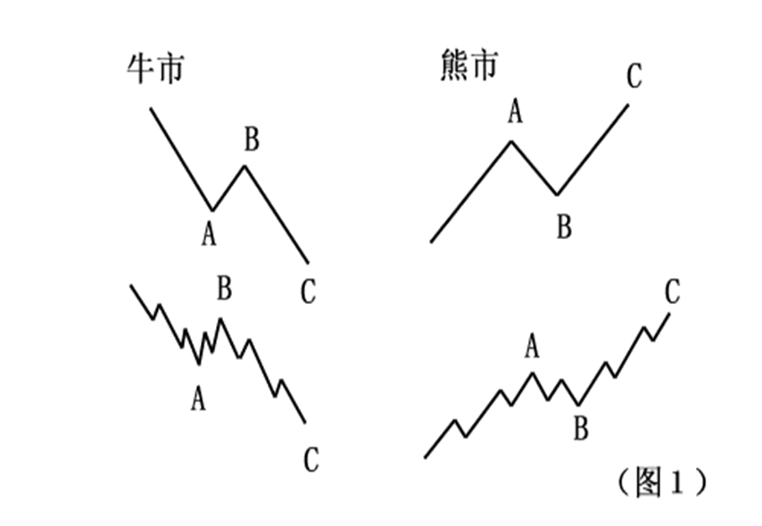

有时，特别是当一个锯齿型态未能达到正常的目标时，市场会出现连续两个（至多三个）锯齿型态。每一个锯齿型态之间由一个“三浪”所连接，即所谓的双重锯齿型或三重锯齿型。这些衍生的变化型态就好比是推动浪中的延伸型态，只是较为少见。 

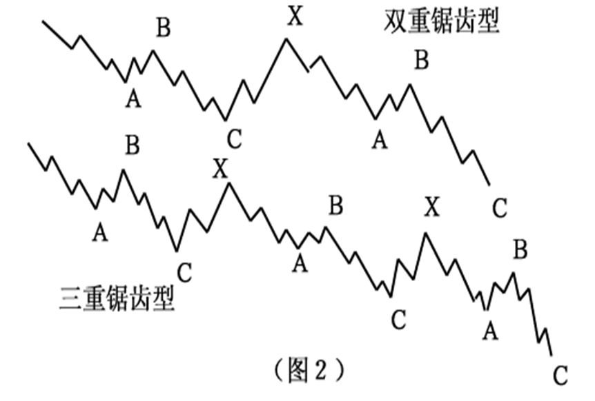

**（２）平台型** 
和锯齿型不一样，平台型的修正浪细分为３－３－５，同样以Ａ－Ｂ－Ｃ标识（如图３）。由于市场在推动浪之后缺乏足够的拉回力度，使得Ａ浪无法像锯齿型修正浪那样 形成完整的五浪。因此，Ｂ浪的反弹（下调）也得以接近Ａ浪的始点才结束。 

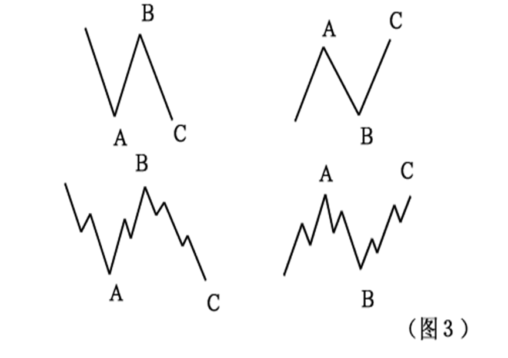

不像锯齿型中的Ｃ浪，结束的位置往往明显低于Ａ浪的终点。空头市场中的平台型态，与多头市场相同，只是倒转过来而已。整体而言，平台型态的修正浪，对于先前推动浪的拉回力度，经常小于锯齿型态。这也是读者预测市场走向比较可靠的依据之一。 

艾略特波浪理论认为，平台型修正浪经常出现在强劲的市场趋势中，许多时候是在延伸浪后出现。而且，市场走势愈强，平台整理的时间就愈短。 

扩张平台是指在平台型态中，Ｂ浪的终点超出Ａ浪的始点水平，而Ｃ浪也明显击破Ａ浪的终点而进一步探底。而强势平台则是指Ｂ浪超越Ａ浪的始点，而Ｃ浪则未击破Ａ浪的终点，显示出市势非常强劲。 

不过，在过往的日子里较大级别修正浪中，很少发现这种型态。 

**（３）三角型态** 

三角型态是唯一以五浪运行的修正浪，其次一级的细浪皆可划分为三浪，即３－３－３－３－３的型态。在三角型态中，大部分的次一级细浪都是锯齿型态（如图５）。但是，有时候某一个次级浪（Ｃ浪的可能性较大）会出现比其它次级浪更加复杂的型态。 

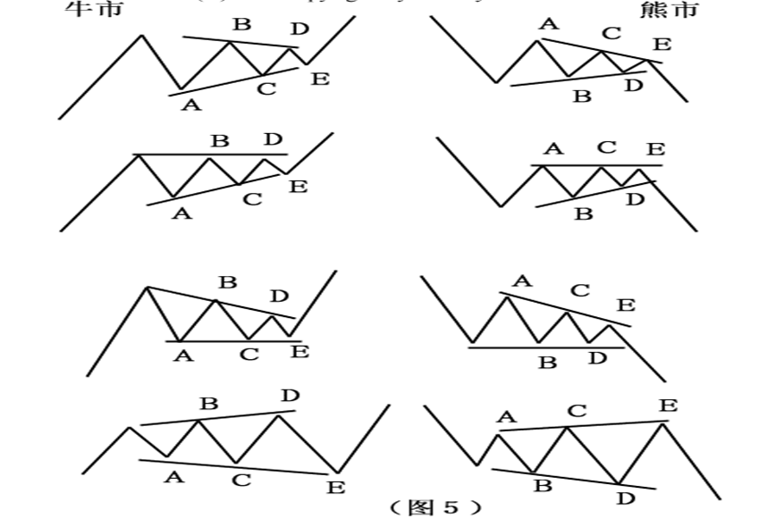

某些时候三角型态将会延伸为九浪，是因为其中一个次级浪本身以三角型态出现，Ｅ浪的可能性最大。 

艾略特认为，三角型态只会出现在第４浪、Ｂ浪或Ｘ浪中。第２浪形成三角型态的机会甚少。 

股票市场中，当三角型态结束之后运行的推动浪经常会出现“飚升”的情形。其上升目标大概就是三角型态最宽部分的距离。 

**（４）双重三或三重三型态** 

前面三种形态，都是简单型态的修正浪。而下面我们所讨论的双（三）重三则是复杂型态的修正浪（如图６）。 

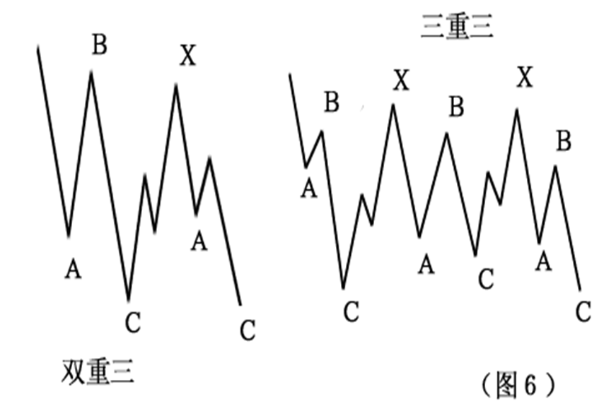

艾略特认为，当一个简单型态的修正浪运行结束之后，如果市场不允许出现新一组推动浪，那么它还要继续在过渡浪（标记为Ｘ浪）之后再运行一个修正浪。有时候，这种情况还要重复两次。而很多时候，是基本面的因素导致了这种局面的产生。 

前面我们曾提到过双重平台、三重平台，艾略特之所以将它们归入双重三或三重三型态，是因为他认为水平型态的修正浪和双重锯齿型态的非水平修正浪有所区别。 

我想，如果单纯以型态划分，这样的意见不够严谨。但是，如果对于在实际分析工作中，着重于修正浪的运行幅度来说，这样的划分显然更加合乎情理，也更容易让初学者接受。 

#### 修正浪的变异型态

常人共有１０指和１０趾。但平常，我们也见过１２指的人，我们不能说他不是人，只能说他有些怪而已。 

**（１）强势三角形** 

通常三角型态中每一个次级浪均是依次递减（增）的，但在某些时候，特别是收缩三角形中，ｂ浪会突破ａ浪的始点，这样就形成了强势三角形型态。 

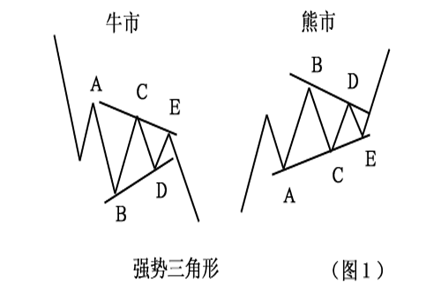

**（２）前置三角形**

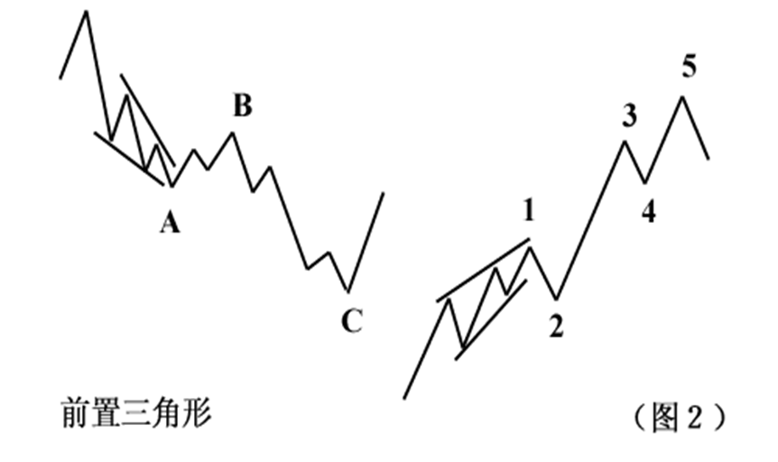

**（３）变异的锯齿型** 

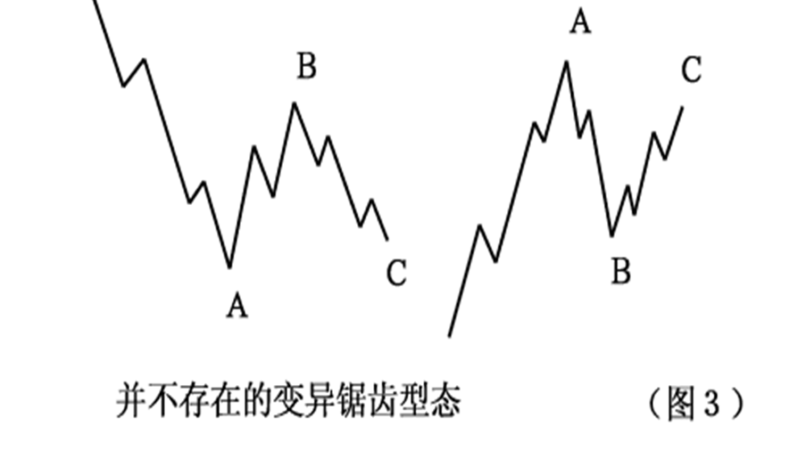

**（４）非常态顶部**

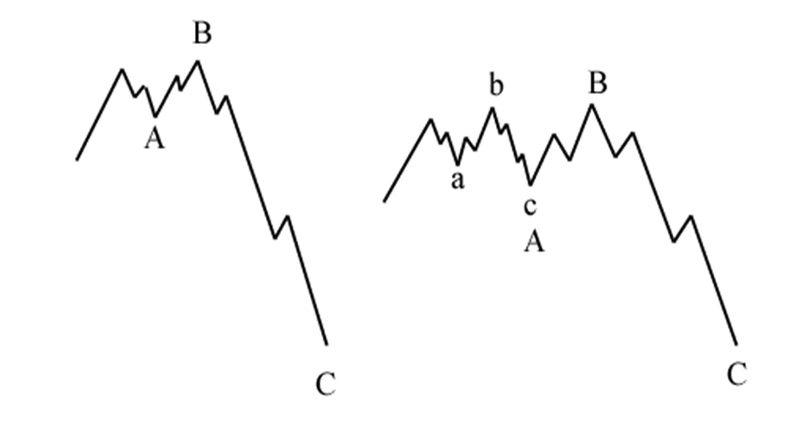

**（５）“Ａ－Ｂ底”：**

所谓“Ａ－Ｂ基础”的结构在Ａ－Ｂ底的型态中，市场在结束一段符合波浪划分的下跌走势之后以３浪向前推进，然后再出一段３浪下跌，最后才进入多头市场。 

我认为第（３）及第（５）项不能成立。另外，艾略特还提到了一种叫“半月”的形状。但不是修正浪的具体型态（图５），它只是价格指数走势的描述。在一个上升或下跌过程中，市场的多空力量对比缓慢地变化，以至突然加速，然后在一根长阳或长黑中结束。

#### 理想化的艾略特波动序列

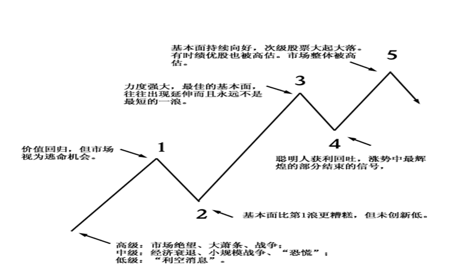

#### 艾略特波浪进阶

艾略特波浪理论三要素：浪型、幅度和时间。三者的重要性如排列顺序。 

**第１浪**

在技术上较具建议性。成交量及市场宽度出现明显的增加。但是，市场中绝大多数人只是认为不容易出现的一次中级行情而已。然而事实上，这一回价格指数出现了５个次一级的推动浪。不过，大部分的第１浪只是整个市场底部的一部分，随后的第２浪将会令市场认为熊市又再重现。大级别的第１浪总是在价格指数经历痛苦的调整之后出现的，市场资金充裕，但经济仍处于不景气，不过未来前景乐观（图２）。 

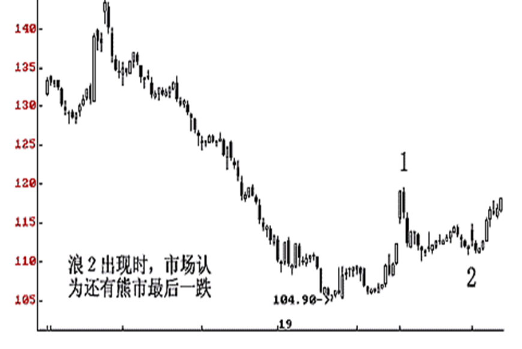

**第２浪**

它经常把第１浪的升幅吃去大半，以致于在第２浪的终点出现时，市场无利可言。因此，第２浪出现锯齿型或双重锯齿的概率比第４浪要大。 

**第３浪**

奇迹！强大且宽广。各种资金纷纷介入，令供求关系失衡，基本面彻底改善，投资者的信心明显恢复了。通常，会出现最大的成交量及价格变动。中等级别的第３浪通常是所有推动浪中最长的，经常出现延伸。如果是股票市场，二线股（特别是股本比较小的那一类）会脱颖而出，而三、四线股也试图跑出几只黑马。 

**第４浪**

第４浪通常比较规范。其深度及运行时间也比较容易预测。在一般情况下，第２浪简单与第４浪复杂总令市场人士始料不及。高价股的碎步与低价股的上窜下跳也确实精彩。　　　　　　　由于第５浪高价股很少有精彩的表演，故小幅上落较为正常，而低价股大幅回吐也只是为强劲的第５浪去制造泡沫而打底。 

**第５浪**

通常是产生泡沫的地方。市场到处呈现出一片繁荣的景象。人们开始透支未来。但是，市场上原来的领头羊现在已退居二线地位。在较大级别的第５浪，我们常常可以听到某些分析师的“豪言壮语”。大级别的第５浪在经济未开始变坏之前，可能就结束了。这时，你甚至会听说水果档的老板娘在股市中赚到了多少钱（图３)。 

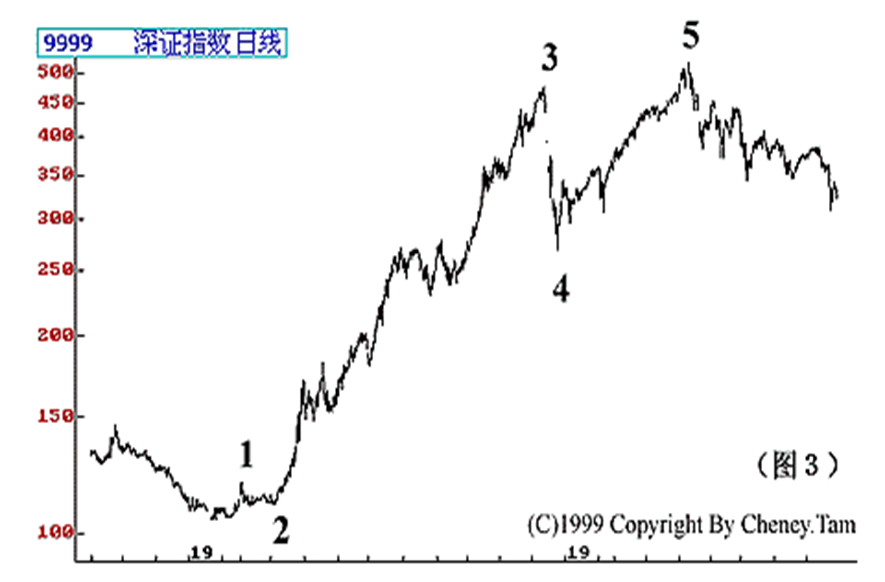

**Ａ浪**

市场大众一般都会相信，“Ａ浪”只是正常的调整或反弹而已。有时，个别股票会提前出现大跌，技术上极具杀伤力。但散户仍然无视风险，坚决买入。Ａ浪为接下来的Ｂ浪铺底。 

**Ｂ浪**

“Ｂ浪是骗人的，是叫人上当的把戏，是多头陷阱，是投机者的天堂，也是散户心态的放纵。”通常，市场大众会认为Ａ浪只是正常的回调，Ｂ浪出现时大部分人会认为新一轮升浪已展开。传统的波浪理论认为，Ｂ浪在技术上很少是强劲的。在Ｂ浪中活跃的股票经常是有限的数量。特别是中等以上的级别，经常可以见到次级股票大幅下跌后的回升乏力，但绩优股却十分抗跌。投资者如果感觉到这个市场不对劲，那么，Ｂ浪的可能性就很大了（图４）。 

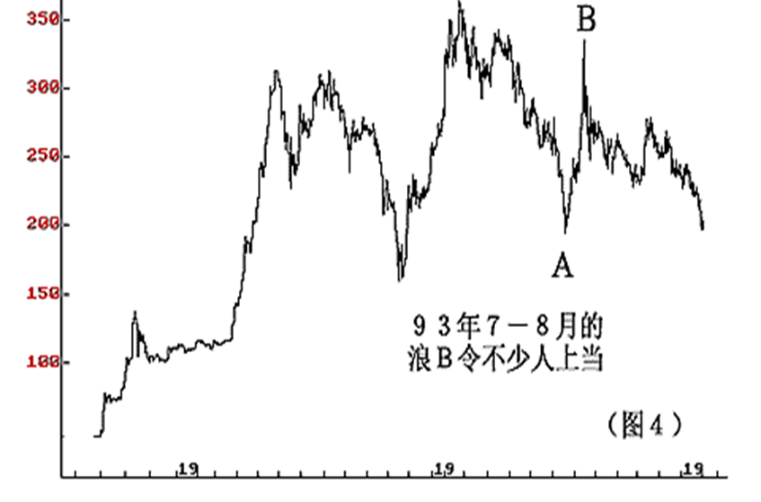

**Ｃ浪**

下跌Ｃ浪通常极具破坏性。投资者在这个跌势中，除了抛售套现，别无他法。这个特性，在锯齿型中得到充分体现。上述的波浪特性，只是建议性的。并不意味着必然如此，那样的话，则是违反波浪理论的。这个世界除了“１＋１＝２”之外，再也没有其他所谓“必然”的东西了。波浪特性有时会误导投资者，以至贻误战机。因此，敬请投资者在实际分析工作中，一定要以浪型为准。然而，了解波浪的特性，分析师将会自信得多。 

**神奇数列**

既然波浪理论是“自然法则”，其理论基础应是在现实世界中的某些规律。“０．６１８”最初是由古埃及的数学家所发现并称之为“黄金比率”。在日常生活中，这样的例子随处可见。直至三世纪，数学家费波纳奇提出一个数列：　１，１，２，３，５，８，１３，２１，３４，５５，８９，１４４，２３３，３７７…… 

这个数列被称为费波纳奇数列。这个数列有如下特性：　　　　　　　　　

（１）任何相列的两个数字之和都等于后一个数字，例如：　　　　　　　　　

１＋１＝２；　　　　　　　　　

２＋３＝５；　　　　　　　　　

５＋８＝１３；　　　　　　　　　

１４４＋２３３＝３７ ７；　　　　　　　　　

…… 

（２）除了最前面３个数（１，２，３），任何一个数与后一个数的比率接近０．６１８，而且越往后，其比率越接近０．６１８：　　　　　　　　　

１÷５＝０．６；　　　　　　　　　

８÷１３＝０．６１８；　　　　　　　　　

２１÷３４＝０．６１８；　　　　　　　　

…… 

（３）除了首３个数外，任何一个数与前一个数的比率，接近１．６１８。有趣的是，１．６１８的倒数是０．６１８。例如：　　　　　　　　　

１３÷８＝１．６２５；　　　　　　　　　

２１÷１３＝１．６１５；　　　　　　　　　

３４÷２１＝１．６１９；　　　　　　　　　

…… 

（１）若推动浪中的一个子浪出现延伸，其他两个推动浪运行的幅度及时间，将会趋向一致。假设，当第３浪成为延伸浪，则第１浪与第５浪的升幅度运行时间将会大致相同。如果不是，则也可能以０．６１８的关系出现。 

（２）Ｃ浪的长度，常常以Ａ浪的１．６１８倍出现。可以利用下列公式测试Ｃ浪的下跌目标。

Ａ浪终点－Ａ浪×０．６１８ 

（３）水平三角形内，每个次级浪的升跌幅度与其他浪的比率，通常以０．６１８的比例出现。

（４）第５浪的运行距离，与第１浪始点至第３浪终点的距离，也存在神奇数列的比率关系。

值得记住的神奇数有下列几个：０．６１８，０．３８２，０．５，１，１．６１８……。 

#### 波浪理论的游戏规则

三个推动浪中，第３浪不可能是最短的。这是波浪划分时最重要的“戒条”。事实上，如果不是这样，则会造成波浪理论的混乱。在现实世界，第３浪往往是３个推动浪中最长的。

第４浪不可以与第１浪重叠，除非其更大级别的波浪是倾斜三角形的第１浪或第５浪这也是一个“颠扑不破”的法则。如果允许重叠，那么可能意味着现实世界的“进步”是不可能的了。

水平三角形型态只允许出现在第４浪或Ｂ浪、Ｘ浪上，以３－３－３－３－３型态运行。

对于这个规则，我只能说在没有足够的证据认为它是错误的之前先认为它是对的。事实上，它对于读者划分波浪十分有用，因为至今，我还没有发现，第２浪也会以三角形的型态出现。

５浪进行的推动浪，会有两个浪具有相当的时间，大小也相同。若非如此，则具有０。６１８的比例。

#### 波浪理论的原理

许多从事过波浪理论研究并在实际操作中付诸实施的投资者都曾会感到波浪理论不易领会，甚至望而生畏。波浪理论的基本原则其实很简单，读者在不久将会发现波浪理论涵盖的许多要点。看起来似曾相识，这是因为波浪理论的许多架构，相当符合道氏理论的原理和传统的图型技术。不过，波浪理论已超越传统的图型分析技术，能够针对市场的波动，提供全盘性的分析角度、得以解释特定的图形型态发展的原因与时机，以及图形本身所代表的意义，波浪理论同时也能够帮助市场分析师、找出市场循环周期的所在。 

曾经有人说过，多数的技术分析，在本质上是属于逐势分析。道氏理论，且不谈其所有的优点，也是在趋势形成之后，才出现确认的讯号，波浪理论则能更进一步的对头部与底部作出预警讯号，而且能以较传统的分析方法加以确认，在以下的章节，我们将重点指出波浪理论与较为人熟知的图型分析的两者之间的共同点。 

##### 数浪的基本规则

投资者应了解，艾略特的波浪理论其关键主要包括三个部分，第一，为波浪的形态；第二，为浪与浪之间的比例关系；第三，作为浪间的时间间距。而这三者之间，浪的形态最为重要。 

波浪的形态，是艾略特波浪理论的立论基础，所以，数浪的正确与否，对成功运用波浪理论进行投资时机的掌握至关重要。 所谓数浪的基本规则，只有两条。如果投资者能对这两条基本数浪规则在平时运用中坚守不移，可以说已经成功了一半。 

##### 数浪的两条基本规则

 一、第三浪（第三推动）永远不允许是第一至第五浪中最短的一个浪。在股价的实际走势中，通常第三浪是最具有爆炸性的一浪，也经常会成为最长的一个浪。

 二、第四个浪的底部，不可以低于第一个浪的浪顶。

除了以上两个在数浪时的铁律外，还有两个补充规则，这两个补充规则并非是牢不可破的铁律,它主要是帮助投资者能更好的判别浪型,协助正确数浪工作。 

 

**补充规则一：交替规则**

如果在整个浪形循环中，第二个浪以简单的形态出现，则第四浪多数会以较为复杂的形态出现。第二浪和第四浪就性质而言，都属于逆流行走的调整浪，而调整浪的形态有许许多多种子类型。这条补充规则，能较好地帮助投资者分析和推测市场价格的未来发展和变化，从而把握住出入的时机。 

**补充规则二**

股市在上升一段后进入调整期，尤其是当调整浪乃属于第四浪的时候，多数会在较低一级的第四浪内完成。通常性情况下，会在接近终点附近完结。这条补充规则主要是为投资者提供调整的终结点，从而使投资者了解在调整临近终结时，应注意做多、做空时的策略。不使投资者操作犯方向性的大错，铸成不可逆转的局面。 

**第一浪**

在整个波浪循环开始后，一般市场上大多数投资者并不会马上就意识到上升波段已经开始。所以，在实际走势中，大约半数以上的第一浪属于修筑底部形态的一部分。由于第一浪的走出一般产生于空头市场后的末期，所以，市场上的空头气氛以及习惯于空头市场操作的手法未变，因此，跟随着属于筑底一类的第一浪而出现的第二浪的下调幅度，通常都较大。 

**第二浪**

上面已经提过，通常第二浪在实际走势中调整幅度较大，而且还具有较大的杀伤力，这主要是因为市场人士常常误以为熊市尚未结束，第二浪的特点是成交量逐渐萎缩，波动幅度渐渐变窄，反映出抛盘压力逐渐衰竭，出现传统图形中的转向形态，例如常见的头肩、双底等。 

**第三浪**
第三浪在绝大多数走势中，属于主升段的一大浪，因此，通常第三浪属于最具有爆炸性的一浪。它的最主要的特点是：第三浪的运行时间通常会是整个循环浪中的最长的一浪，其上升的空间和幅度亦常常最大；第三浪的运行轨迹，大多数都会发展成为一涨再涨的延升浪；在成交量方面，成交量急剧放大，体现出具有上升潜力的量能；在图形上，常常会以势不可挡的跳空缺口向上突破，给人一种突破向上的强烈讯号。 

**第四浪**

从形态的结构来看，第四浪经常是以三角形的调整形态进行运行。第四浪的运行结束点，一般都较难预见。同时，投资者应记住，第四浪的浪底不允许低于第一浪的浪顶。 

**第五浪**

在股票市场中，第五浪是三大推动浪之一，但其涨幅在大多数情况下比第三浪小。第五浪的特点是市场人气较为高涨,往往乐观情绪充斥整个市场。从其完成的形态和幅度来看，经常会以失败的形态而告终。在第五上升浪的运行中，二、三线股会突发奇想，普遍上升，而常常会升幅极其可观。 

**A浪**

在上升循环中，A浪的调整是紧随着第五浪而产生的，所以，市场上大多数人士会认为市势仍未逆转，毫无防备之心，只看作为一个短暂的调整。A浪的调整形态通常以两种形式出现，平坦型形态与三字形形态，它与B浪经常以交叉形式进行形态交换。 

**B浪**

B浪的上升常常会作为多方的单相思，升势较为情绪化，这主要是市场上大多数人仍未从牛市冲天的市道中醒悟过来，还以为上一个上升尚未结束，在图表上常常出现牛市陷阱，从成交量上看，成交稀疏，出现明显的价量背离现象，上升量能已接济不上。 

**C浪**

紧随着B浪而后的是C浪，由于B浪的完成顿使许多市场人士兵醒悟，一轮多头行情已经结束，期望继续上涨的希望彻底破灭，所以，大盘开始全面下跌，从性质上看，其破坏力较强。

（一）0.382：第四浪常见的回吐比率及部分第二浪的回吐百分比，B浪的回吐过程（ABC浪以之字形运行）； 

（二）0.618：大部分第二浪的调整深度。对于ABC浪以之字形出现时，B浪的调整比率。第五浪的预期目标与0.618有关。三角形内的浪浪之音质比例由0.618来维系； 

（三）0.5：0.5是0.382与0.618之间的中间数，作为神奇数比率的补充。对于ABC之字型调整浪，B浪的调整幅度经常会由0.5所维系。 

（四）0.236：是由0.382与0.618两神奇数字比率相乘派生出来的比率值。有时会作为第三浪或第四浪的回吐比率，但一般较为少见，常常是在事后才如梦初醒，调整过程已经结束； 

（五）1.236与1.382：对于ABC不规则的调整形态，我们可以利用B浪与A浪的关系，借助1.236与1.382两神奇比例数字来预估B浪的可能目标值； 

（六）1.618：由于第三浪在三个推动浪中多数为最长一浪，以及大多数C 浪极具破坏力。所以，我们可以利用1.618来维系第一浪与第三浪的比例关系和C 浪与A浪的比例关系； 对于斐波南希神奇系列数字，读者已经了解到在波浪理论中，尤其在对波浪理论的定量分析中，起着极其重要的作用。其中0.382与0.618为常用的两个神奇数字比率。其使用频率较其它的比率要高得多。 

#### 波浪理论的几个基本要点

1、一个完整的循环包括八个波浪，五上三落。

2、波浪可合并为高一级的浪，亦可以再分割为低一级的小浪。 

3、跟随主流行走的波浪可以分割为低一级的五个小浪。 

4、１、３、5三个波浪中，第３浪不可以是最短的一个波浪。

5、假如三个推动浪中的任何一个浪成为延伸浪，其余两个波浪的运行时间及幅度会趋一致。 

6、调整浪通常以三个浪的形态运行。

7、黄金分割率奇异数字组合是波浪理论的数据基础。 

8、经常遇见的回吐比率为0.382、0.5及0.618。

9、第四浪的底不可以低于第一浪的顶。 

10、波浪理论包括三部分：型态、比率及时间，其重要性以排行先后为序。

11、波浪理论主要反映群众心理。越多人参与的市场，其准确性越高。

#### 波浪理论的缺陷

1、波浪理论家对现象的看法并不统一。每一个波浪理论家，包括艾略特本人，很多时都会受一个问题的困扰，就是一个浪是否已经完成而开始了另外一个浪呢？有时甲看是第一浪，乙看是第二浪。差之毫厘，失之千里。看错的后果却可能十分严重。一套不能确定的理论用在风险奇高的股票市场，运作错误足以使人损失惨重。 

2、甚至怎样才算是一个完整的浪，也无明确定义，在股票市场的升跌次数绝大多数不按五升三跌这个机械模式出现。但波浪理论家却曲解说有些升跌不应该计算入浪里面。数浪（WaveCount）完全是随意主观 

3、波浪理论有所谓伸展浪（ExtensionWaves），有时五个浪可以伸展成九个浪。但在什么时候或者在什么准则之下波浪可以伸展呢？艾略特却没有明言，使数浪这回事变成各自启发，自己去想。 

4、波浪理论的浪中有浪，可以无限伸延，亦即是升市时可以无限上升，都是在上升浪之中，一个巨型浪，一百几十年都可以。下跌浪也可以跌到无影无踪都仍然是在下跌浪。只要是升势未完就仍然是上升浪，跌势未完就仍然在下跌浪。这样的理论有什么作用？能否推测浪顶浪底的运行时间甚属可疑，等于纯粹猜测。 

5、艾略特的波浪理论是一套主观分析工具，毫无客观准则。市场运行却是受情绪影响而并非机械运行。波浪理论套用在变化万千的股市会十分危险，出错机会大于一切。 6、波浪理论不能运用于个股的选择上。