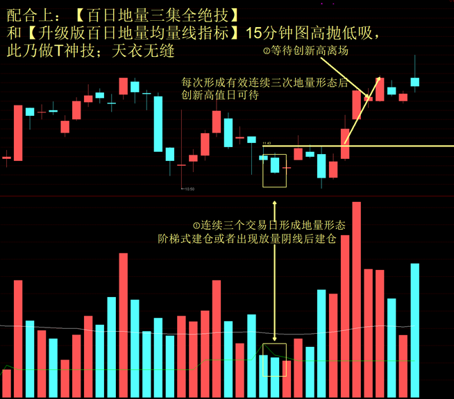

		“百日地量”看似是一个不成问题的问题，实际上却涉及一个重要的概念——成交量特性分析。

​		以股价趋势的量“来预测”势，这种研判方法因有技术上的理论基础，所以为华尔街的技术分析人士广泛采用。不同于量学对量柱的完全分类：高低平倍梯锁金七要素，他们从操作层面把成交量值按特性分为：大成交量，小成交量，安全成交量，危险成交量，进货成交量和出货成交量。这些量通常并非单根量柱而是量柱群。“百日地量”对应其“小成交量”。

​		小成交量对应两种市状：冷门股和空头市场的成交量值特性。前者非我们讨论的范围，后者则设计“百日低量”的概念。空头市场的最大特征是随股价创新低成交量值呈现萎缩态势：出现新低价，小成交量亦创新纪录，直至成交量不能再萎缩而形成百日低量，这是空头市场结束的前兆。何时趋势会发生反转？出现小倍阳是典型的量学特征。

指标简介: 

​		地量在行情清淡的时候出现的最多。在行情清淡的时候，人气涣散，交投不活，股价波动幅度较窄，场内套利机会不多，几乎没有任何赚钱效应。持股的不想卖股，持币的不愿买股，于是地量的出现就很容易理解了。这一时期往往是长线买家进场的时机。 地量在股价即将见底的时候出现的也很多。

　　一只股票经过一番炒作之后，总有价格向价值回归的道路。在其慢慢下跌途中，虽然偶有地量出现，但很快就会被更多抛压淹没，可见地量持续性较差。而在股价即将见底的时候，该卖的都已经卖了，没有卖的也不想再卖了，于是地量不断出现，而且持续性较强。如果结合该公司基本面的分析后，在这一时期内介入，只要能忍受得住时间的考验，一般均会有所收获。 地量在庄家震仓洗盘的末期也必然要出现。

　　任何庄家在做庄的时候，都显然不愿意为别的投资者抬轿子，以免加大自己拉升途中的套利压力，于是，拉升前反复震仓、清洗获利盘就显得非常必要了。那么，庄家如何判断自己震仓是否有效，是否该告一段落呢？这其中方法与手段很多，地量的出现便是技术上的一个重要信号。此时，持股的不愿意再低价抛售，或者说已经没有股票可卖了，而持币的由于对该股后市走向迷茫，也不敢轻易进场抢反弹，于是成交清淡，地量便油然而生，而且一般还具有一定的持续性。这一时期往往是中线进场时机，如果再结合其它基本面、技术面的分析，一般来说均会有上佳的收益。

　　地量在拉升前整理的时候也会间断性地出现。一只股票在拉升前，总要不断地确认盘子是否已经很轻，以免拉升时压力过大而做庄失败。换句话说，就是拉升前要让大部分筹码保持良好的锁定性，即“锁仓”。而要判断一只股票的锁仓程度，从技术上来说，地量间断性地出现是一个较好的信号，由于庄家需要不断地对倒制造成交量以达到震仓目的，所以，这一阶段中，地量的出现是间断性的。如果能在这一时期的末期跟上庄，你可能会吃到这一只股票最有肉的一段。

　　由此可见，地量作为成交量指标的一种表现形式，由于其不可能存在欺骗性，而且对投资者的操作具备相当的实战指导价值，因而授之以“最有价值的技术指标”的桂冠，实为众望所归，其真实性及实用性是其它技术指标所望尘莫及的。

　　

　　结合市场: 当市场整体运行趋势向上时，如果投资者确认曾经出现地量，那么可以在有温和放量伴随的股价上涨过程中择机介入；当市场整体运行趋势向下时，投资者即使确认前期曾经出现地量走势，也最好不要轻易介入。因为，在弱势格局中，即使暂时确认了地量，也不排除在今后行情中出现更低的地量。

　　对地量的运用要结合技术分析的方法。技术分析方法有两种：一种是结合技术形态进行分析，当地量出现的同时，股价或指数也同时走出比较完善的底部形态，其中有圆弧底、V形底、双底、潜伏底、头肩底等底部形态，这时就可以考虑买入。另一种是结合技术指标分析，主要是参考随机指标KDJ指标和乖离率BIAS指标。当BIAS指标小于-6，KD指标产生黄金交叉，K线上穿D线，在KD交叉同时，KD指标中的D值小于16，J值小于0，并且确认前期有地量出现时，可以积极介入。 结合个股:分析出现地量的具体原因。是因为股价暴跌，市场中几乎没有获利盘产生的地量，还是庄家高度控盘导致的地量，或是因为股价涨幅过大，缺少跟风盘引起的地量。投资者要针对不同的地量产生原因，采用不同的投资方法。

　　结合资金:投资者常常有种错觉，认为地量可以止跌。实际上地量是否能止跌并不取决于地量本身，而取决地量之后的放量。当增量资金及时介入，就会出现地量地价的情况；当增量资金介入缓慢时，地量将无法止住下跌的趋势，直到股价下跌到某一深度后，大批增量资金被吸引进来时，方能止跌。地量过程:地量在拉升前整理的时候也会间断性地出现。一只股票在拉升前，总要不断地确认盘子是否已经很轻。而要判断一只股票的锁仓程度，从技术上来说，地量的间断性地出现是一个较好的信号，由于庄家需要不断地对倒制造成交量以达到震仓目的，所以，这一阶段中，地量的出现是间断性的。如果能在这一时期的末期跟上庄，你可能会吃到这只股票最有肉的一段。

　　放量下跌:放量上涨:在一段时间内，连续缩量的运行状态不会发生明显变化，甚至在出现20%以内的地量后，再次出现更小的地量。因此我们只能把20%这一信号作为可能的信号，大资金可以进行试探性建仓。出现时间:如2003年10月中旬以后，大盘震荡加剧，下跌过程中成交放大，随后筑成中期底部。而且从历史上其他几次底部形成规律看，在长期下跌的末段，出现地量后再次放量下跌，基本上可以肯定是底部信号。运行方式: 这是典型的上涨信号，无需多说。

　　地量规则还可以用来预测牛市中的调整是否结束，以及当前的调整到底是中级调整，还是小级别的调整。如果成交量在下跌过程中能够迅速缩小到高峰期的30%以内，则调整可望结束，牛市继续的概率较大。反之，如果在下跌的过程中，成交量不能有效萎缩，说明市场分歧较大，大主力在利用人们惯性心理大幅减仓，调整的幅度将加大，时间将延长。

如上图所示：
个股在下跌途中，探底的时间出现了明显的缩量形态，量能在【百日地量指标】绿色均线之下，两个阴线，一个阳线，呈现的缩量的量能柱；股价这这段时间出现的探底信号，行情这这段时间即将形成主升浪形态趋势；直接创新高，这种股票值得所有人关注！

