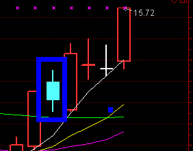

第一步：首先拥有百日地量指标【注意不是成交量VOL】

第二步：打开通达信软件，在键盘上输入60排行榜找到今日涨停板，注意不是涨停板不要，做股要做强势，地量是洗盘的结束，涨停是爆发的开始，非涨停也有动力不过要选择强势的涨停

第三步：从第一只股票打开判断在近五日有没有成交量小于绿色芝麻线，并且在今日涨停时突破白色60日均量线，一定要在五日内，超过五个交易日失去时效性，万万不可凑合

**成交量小于绿色芝麻量**

**突破白色60**

**日均量线标准形态**

第四步：从上到下挨个看过去，从第一个涨停板到最后一个涨停板挨个筛选

建立每日自选板块，在通达信软件的页面上按CTRL+Z 

加入自选板块股里

第五步：买入点位，买阴不买阳，买低开不买高开，回踩买入，最佳点位，持有时间在一周在两周时间，最多不超过两周，或者是获利20%走人 。

选股示例

见证奇迹——百日地量超级选股，用事实证明一切，用奇迹见证百日地量的崛起！

