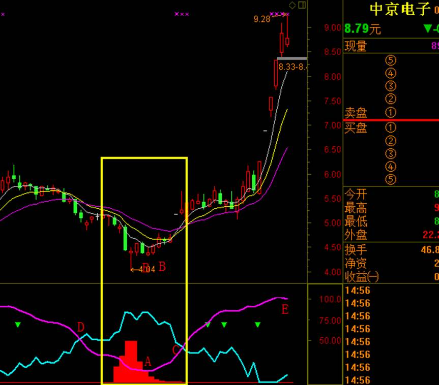
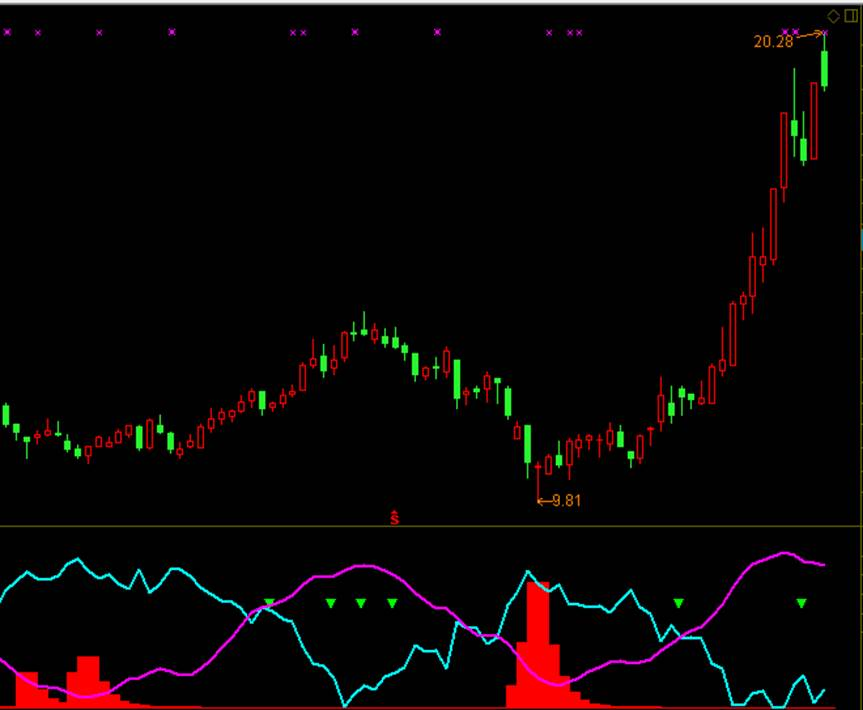
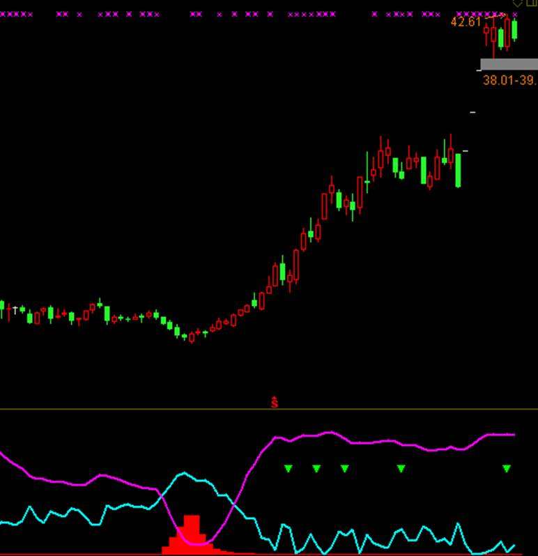
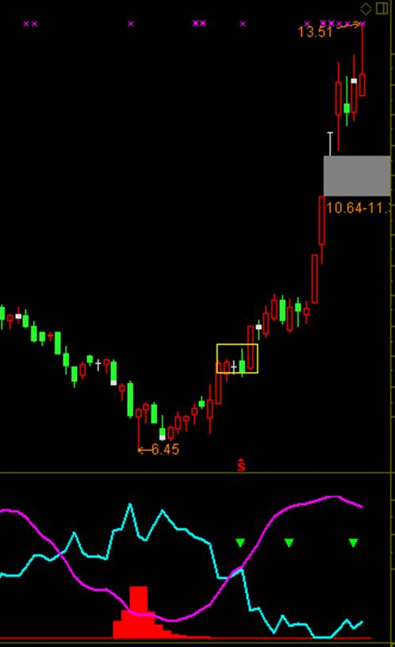

庄影追踪（庄见愁）一一破解股市的哥德巴赫猜想

揭示了庄家与散户博弈的真谛！告诉你庄家在什么位置大举建仓！庄家在什么位置起暴！诠释了炒股的真理！此指标适合捕捉中线翻番大牛股！

所谓庄影追踪就是寻找主力的影子，发现主力的迹象，什么时候他们会建仓，什么时候他们要拉升盘面了，都能够扑捉出来。

主力建仓会有一些特别的信号，本次的庄影追踪就能够发现吸筹信号，还能够发现他们逃跑的信号，他们什么时候要出逃，要派发筹码都是能够察觉的。

最重要的是我们能够成功的扑捉一只股票的主力持仓和散户持仓比例。

真是如此吗？请看下图

这就是一只比较典型的庄影追踪信号的股票。

A：该点也是最低点，在这个位置我们发现了一堆红色的筹码，这个就是我们发现主力在这个点位吸筹了，这个点位就是我们逢低布局的时候了。同时真正的买点也是那根紫色线离开红色筹码的时候就是买点的时候了。

B：最低点刚刚形成筹码的吸筹，下一步就是要拉升了。

C：这个点位代表两个线的交叉，这两根线其实有一根是紫色，有一根是青色，紫色代表庄家线，青色代表散户线。当庄家线处在高位的时候，则代表见顶了，主力不可能再吸筹了。当散户线在底部的时候则代表散户要开始进场了。

D：两线死叉表示主力和散户的持仓持相等。

庄影追踪有四种信号给我们指引：

1、红色柱体密集区： 表明主力在此处得到大量的廉价筹码同也建了大量的仓位，叫吸筹！这里是产生心理共振散户全线割肉的一个区间。

2、紫色线为庄家持仓线，代表庄家持仓情况； 向上则说明庄家增仓已经拿到了廉价的筹码，股价也会随着向上拉升，向下说明庄家减仓出跳！股价也会有相应的调整。

3、浅蓝色线为散户持仓线代表散户持仓情况。 散户持仓线向上说明散户在跟风，股价也会伴随着下跌，浅蓝色散户持仓线下跌时说明散户在割肉砍仓， 散户把筹码交出去后股价也开始了拉升。

4、绿色小三角，说明超买的波段回踩，逢低小三角可以用小时线做出波段来。

买卖点

出现吸筹信号我们可以重点关注这只股，第一买入位：紫色庄家持仓线上穿红色吸筹信号，这说明筹码交换完成，主力开始控盘，仓位也随之而增加，股价自然就被快速拉升

请看下方例子：

中国软件：每次吸筹都要涨一波

华谊兄弟：吸筹就涨

证通电子：不吸筹不见底

这个指标是不是简单实用又给力呢？各大高手经典巨献。你值得拥有。