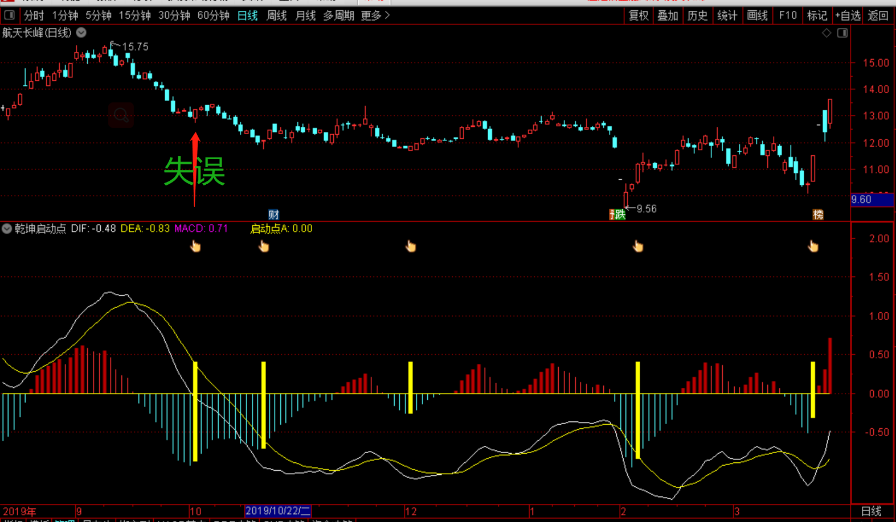

乾坤启动点是在改变MACD的参数之后而成的，优化原MACD的参数是因为原参数出信号过多，有很多假信号易造成失误，优化后去掉了很多无用的信号，虽然少，但能让你买在大跌或洗盘之后波段的启动点上，接近波段最低点的位置！

最适合来回振荡并且股性活跃的个股，信号少但准确度高！

1：出黄柱(手指)就是第一买点！

2：绿柱消失，出红柱(金叉位置)也是买点！但股价会比启动点高！可结合量价关系决定是否买进！

3：这个指标非常简单，它只在MACD的0 轴之下出信号！ 

4：如果你想让它更灵敏，调节源码里的数值即可！或用60分钟周期！但越灵敏失误也会增多！

有时出信号时，我们并不能判定它就会上涨，它只是给我们一个提示，这是一个入场点，仅此而已！技术指标的作用也是如此，一个提示罢了，涨不涨只有主力才知道！

总之，在使用MACD指标时，必须判定市场的属性。即目前的市场是多头市场，还是空头市场。根据不同的市场属性，采取不同的操作策略，以回避风险，保障利润的目的。

这个就出现了失误，如果你能及时止损，在出红柱时再把它买回来，也能弥补失误带来的损失！（不要频繁换股！）