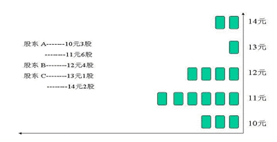

[TOC]

**Content**

[筹码理论起源及简介](#一-筹码理论起源及简介)

- [筹码理论起源](#1-筹码理论起源)
- [筹码理论的优缺点](#2-筹码理论的优缺点)

[筹码理论知识](#二-筹码理论知识)

- [什么叫做筹码 筹码有什么作用](#1-什么叫做筹码-筹码有什么作用)
- [筹码分布的基本形态](#2-筹码分布的基本形态)

[用筹码分布分析主力行为](#三-用筹码分布分析主力行为)

- [主力吸筹](#1-主力吸筹)
- [主力的控盘模式](#2-主力的控盘模式)
- [主力的出货](#3-主力的出货)

#### 一 筹码理论起源及简介

##### 1 筹码理论起源

筹码理论诞生于上个世纪九十年代末期，发展至今已经有十几年的历史。她的创建和发展改变了技术分析引用国外技术分析的主流模式，填补了中国证券市场文化的一项空白。筹码理论技术分析不是舶来品，纯粹是国人的智慧结晶。雪峰老师是筹码理论的鼻祖。他率先提出了用筹码成本变化来研判股价走势的设想，并在《股市技术分析实战技法》（地震出版社）一书中首次论述了成本转换原理和移动成本分布。这是中国证券技术文化市场的新思想，为以后筹码分布理论的深入发展奠定了基础。

##### 2 筹码理论的优缺点 

 筹码理论的原理基于持筹成本的统计。从理论上说筹码交易的操作必然会留下踪迹，谁什么价位买进了，以后是否卖出了，应该是有据可查的；把这些踪迹用数学统计模型展现出来，就会得到某只股票的价格分价位详图，这就是以筹码理论为基础的专业分析软件独有的筹码分布图。尤其是把浮筹和锁定筹码通过技术手段区分开来，这样我们就能明白目前市场中所有筹码的价格构成。根据筹码移动变化规律来研判筹码属性，进一步把握操作机会，这是筹码理论的基础。    筹码理论的优点是直观、本质，尤其是在发现、跟踪机构主力方面，具有其他技术理论不可取代的特点。

#### 二 筹码理论知识

##### 1 什么叫做筹码 筹码有什么作用

看过90年代港台电影，尤其是赌神系列电影的。大家都知道，进入赌场首先必须换筹码，在赌

场内是通过筹码进行交易的，而不是通过现金。但是筹码就代表了现金，在赌博结束，可以在

把筹码兑换成现金的。

那么在股市中也可以把所有的股票看成筹码，那么在股市中主力在控盘过程中，必须控制足够

多的筹码，才可能达到控盘的目的。

我们先做这样一个假设：

某公司有 16 股股票，这 16 股被 3 个不同的投资者持有。股东 A 曾在 10 元价位上买过 3 股，而后又在 11 元价位上买了 6 股；而股东 B 则在 12 元的持仓成本上买进了 4 股；股东 C，在 13 元上买了 1 股，在 14 元上持
有2 股。把这 3 位股民的股票加起来，正好是 16 股。我们来做一张图。

在这张图上，我们就把股票换成像麻将牌一样的筹码，在图的右边，我们先把价位标清楚，从 10 元一直标到 14 元，共 5 个价位，然后我们把这些筹码按照当时股东们买它的成本堆放到它相应的价位上。

从这张图上我们可以清楚的看到：这只股票在 11 元价位上，投资者的筹码比较重一些，12 元至 10 元次之，13 元以上筹码量就不多了。此外，除了上面所说的股东 A、B、C 以外，曾经还有一位投资者 D，在 9 元左右买过这只股票，后来又以 11 元转卖给了股东 A，于是 D 先生提出了一个问题，“我 9 元钱的历史交易怎么没有在这张筹码分布图上得到反映？”其实这个问题不难讲清楚，大家注意到图上的筹码总共只有 16 股，而这只股票的流通盘也是 16 股，筹码分布只去表现这一天所有在册股东的建仓成本，由于 D 已经卖掉了自己的股票，所以他的筹码在筹码分布上就看不见了。这是筹码分布的一个重要特征：既它反映一只股票的全体投资者在全部流通盘上的建仓成本和持仓量，它所表明的是盘面上最真实的仓位状况。

##### 2 筹码分布的基本形态

###### 1)筹码的低位密集

筹码的密集形态。如果筹码是在低价位区实现密集，我们就把它称之为筹码的低位密集，而如果筹码是在高价位区实现密集，它就应该被称之为筹码的高位密集。当然，这里的高和低是个相对的概念。股价的高位和低位并不是指股价的绝对值，几元钱的不一定是低，几十元钱的也并不一定是高。因此，筹码的低位密集，是指股价自某个价位深幅下跌之后，在相对的低价位区形成的新的集中。我们可以给筹码的低位密集做一个比较精确的定义：当筹码自高位流向低位，并且在相对低位的狭窄价格空间实现聚集，就叫“筹码的低位密集”。

当筹码形成低位密集之后，这只股票的投资者就发生了一次大规模的换位：早先的高位套牢盘认赔出局。那么，到底是谁割肉离场了呢？我们很难想象股市的投资机构，比如说券商、基金会在这么巨额的亏损上认赔离场。他们是市场上的投资主力，由于他们掌握足够多的资金，所以他们没有投降的必要，实际上这些割肉盘几乎都是散户所为。我们可以有这样的结论，一旦筹码上发生低位密集，那么割肉的一方一定是散户。

那么又是谁承接了这些割肉盘呢？令人遗憾的是，在解析这个问题的时候，我们发现又是散户落入了以往的操作陷进。

因为几乎所有的低位密集的个股在股市中都缺乏吸引力，于是散户们想：这些股票长时间盘恒于某个价位区，肯定是没有消息面上的让人兴奋的题材，所以它连个上涨的迹象也没有。他们不看好这样的个股，不理睬这样的个股。于是我们完全可以把 筹码 的低位密集现象理解为主力的缓慢吸筹。股市上除了散户就是庄家，散户和庄家的行为几乎总是相反的，散户们在割肉，庄家们就可能在进货。

那么诱人可能立刻会产生一个想法：如果我们在发现了 筹码的低位密集之后跟进入场，那么就可能实现跟庄的目的。事情却没那么简单。主力的吸筹是个漫长的过程，当筹码进入低位密集时，主力未必掌握了足够的筹码，就是说主力需要在这些股票的低位密集区蛰伏很长时间，目的是为下一轮行情做准备。对于一般的散户而言，这需要长远的目光和极大的耐心。因而，简单的买进低位密集并不是最佳的选择。那么，如果有投资者参透了低位密集的筹码性质，应该在什么样的情况下买进呢？

其实，低位密集个股最佳的买入条件只有两个：一是确认了主力的高度控盘；二是确认大盘的中级行情已经开始。其中的分析技术，将在以后的课程中详细讲解。

最后讨论低位的幅度问题。有一些股票的股价自高位密集区下跌了 30%左右再次形成密集，这种密集不叫低位密集，因为 30%的下跌太少，我们这里所讲的低位有一定标准，即筹码的转移最少要有 6 个跌停板的空间。之所以这样定位低位密集，是因为我们需要通过筹码的低位密集寻找潜力个股。没有足够深的跌幅，我们则不敢确认这些低位的筹码就是主力的吸筹。为什么必须是 6 个以上的跌停板呢？因为主力的吸筹往往需要30%左右的震荡空间，而主力的出货同样也需要至少 30%左右的震荡空间。如果仅仅是 6 个跌停板，那么在主力的进货箱体之上就是主力的出货箱体。主力的一出一进，其盈利非常有限，如果获利数目比这个数目还要少，主力就会认为没有什么做庄的价值了。毕竟主力处心积虑又老谋深算地操作了许多时间，没有一个象点样的回报行吗？

###### 2)筹码的高位密集

筹码的高位密集，是个相当危险的个股技术特征。高位密集的市场含义是低位获利盘大规模在高位获利了结。股价之所以迅速涨高，一定是主力拉抬的结果；而主力之所以肯拉抬这些股票，一定是他拥有大量的低位筹码；而此时这些低位的筹码在高位的消失，显示了主力正在大规模的出货。可以说筹码的高位密集在大多数情况下，意味着前期主力的离场。

老庄家正在出售股票，承接这些股票的可能是散户，也可能是新庄家。反正有卖的就有买的，这是一个不变的市场法则。我们很难判断买方是谁。统计结果表明，大部分高位密集的个股的后来走势是暴跌，但确实也有一部分个股在呈现高位密集之后，又形成了新一轮的上涨，这可能是新庄入场，做了一把接力炒做。但从投资的安全性考虑，我们建议投资者不要买进高位密集的个股，因为一旦在主力出货时入场，以后解套的机会往往非常渺茫。。所以基本面和庄家到底哪个更能主宰股市的沉浮？投资者应该明白了。

###### 3)筹码的底部锁仓

单就筹码的形态而言，筹码的低位密集和低位锁定看上去是几乎是相差无几的，所不同的是要从筹码的股价趋势来看：筹码的低位密集呈现出的是股价深幅下跌之后的横盘，或是股价深幅下跌之后的低位震荡；而筹码的低位锁定，其股价趋势的走向应该是股价的上扬，就是说低位锁定的股价一般应正处于主力拉升的过程之中。

要解释这个问题，必须探讨一下是什么原因造成了如此多的筹码被锁定到了低位。

本人曾经在股市的中小投资者之间，进行了一轮广泛的调查。我问大家：诸位的操作习惯是不是要等获利很多之后才了结，比如说，大家是不是经常在获利了 30%以上才肯卖出自己手中的股票？大部分中小投资者都回答说：“不”。本人曾是股市中的散户。我炒股时就有这样一个感觉，一旦一只股票的获利超过了 10%，心态上是非常兴奋、紧张甚至是恐惧的——这 10%来的不容易，我们特别怕这到手的钱又被别人拿走了。对中小股民来说，如果浮动盈利达到 10%，还只是心神不定的话，那么一旦浮动盈利达到 20%，几乎就肯定是拿不住了。反观烟台万华这只股票，大量的筹码获利了 30%之多，却不见任何人抛出，是谁有这么好的定力呢？答案只有一个：是庄家。30%对于你我来说都是个大数，对于庄家来说却是太少了。30%的价格空间，可能并不是主力想要获利了结的目标位。

###### 4)筹码的双峰形态

有一种筹码形态，很有味道，就是筹码的双峰形态。

首先是低位峰的获利盘，这些筹码投资者持股时间不长，短期内获得了 10%左右的收益，其获利了结的愿望是可以理解的；而高位峰的历史套牢盘，其套牢幅度已经明显减轻。让深度套牢的投资者割肉是不容易的，但深度套牢的筹码，一旦等到股价有效反弹，投资者由深套减为浅套，就会有一部分的投资者会选择暂时离场。这些割肉的投资者试图等股价回落后再次抄回，以降低持股成本。

于是乎，当股价自下上两个方向来到双峰峡谷的位置时，会引发市场上来自下方获利盘和上方割肉盘的双重抛压。这个抛压又可以称为“夹板抛压”。在大部分情况下，这只股票会受阻于这个“夹板抛压”而暂时停止上涨。在这种情况下，我们更关心股价受阻之后的表现。如果股价受阻回落，我们认为这是正常的现象，不需要予以重视；但假若在这种强大的抛压之下，这只股票的股价没有回落，而是形成在阻力区之内的横盘，这里面就有故事了。因为股价能够在这个并不太低的相对高位站住，而且又是在面临市场抛售的情况下，那么一定有一笔大资金，是它在承接着双峰峡谷中的夹板抛压。散户总是顺势而为的，因此有能力又肯出面托盘的只能是主力。

#### 

#### 三 用筹码分布分析主力行为

筹码分布的一个重要作用是用来侦察和判断主力的行为。可以说，从诞生之日起，筹码分布的各种技术指标就是为了捉庄而设计的，这使得它们非常切近现实。

在我们的股市中，庄家和散户是不平等的。庄家拥有资金优势、信息优势以及人才优势，庄家看散户的牌非常容易，而散户想知道庄家有多少筹码却极其困难。公众投资者获知主力行为的方法，历来是打探消息。殊不知股市上绝大多数的消息都是庄家炮制的，具有极大的虚假成分。事实上，中国股市呈现出的是个很不公平很不合理的格局：庄家炒股的目的是从散户身上挣钱，而散户却不断的从庄家手中获取信息和操作建议，这可以用得到一个成语——与虎谋皮。

筹码分布的研究思路遵循这样的逻辑：庄家无论多么强大，他终归属于投资者的范畴，既然是投资，就需要买和卖，而只要是发生过的买和卖的行为，就会在筹码分布的技术分析图表上留下痕迹，聪明的散户可以通过分析主力进出的迹象，从而获知主力的真实意图。这样一来，散户和主力就可以互为对手了，虽然主力有各种各样的优势，但是尺有所短，寸有所长。散户们的小资金，固然不可能主动引发行情，但小有小的优点，就是完全有可能跟庄进出。在这样的前提下，散户的利润来源成了庄家的操盘成本，这世界就公平了。

但是筹码分布反映的只是市场事实，并不能区分主力的筹码和散户的筹码，因而我们需要研究出一套在筹码分布中识别主力仓位的方法，这就是本章所要讨论的主题。

客观的说，目前此项研究尚处在比较初级的阶段。毕竟通过技术来分析庄家的行为是一个世界级的难题，目前所取得的成果虽然令人兴奋，但研究还远没有结束。

即使将来市场规范了，市场可能不再存在恶意操纵股市的庄家，但市场不可能不存在主力，投资机构的观点永远是我们必须关注的。因为这些投资机构，具有强大的调研能力及专业的分析能力，而且他们还可以通过控股来干预上市公司的运营，提升上市公司的业绩。无中生有的拉抬股价，可以被判为坐庄并遭到谴责，但是

价值发现以及改变和提升上市公司的品质，却恰恰是各类大型投资机构应尽的职责。

所以，研究主力的动向和行为是技术分析永恒的目的和任务，并且也是中小投资者获取投资回报的捷径。

##### 1 主力吸筹

吸筹是主力介入一只股票的第一个实质性动作。当然在吸筹之前，主力需要做非常细致的调研和其他各类准备工作。这些工作一般是在极秘密的状态下进行的，否则一旦消息泄露，散户们会立刻与主力争夺低位筹码，这是主力最不愿意看到的情况。但是，只要是大规模的吸筹，主力便很难做到不留痕迹，总有一部分中小投资者进货成本同主力是一样的，这就是跟庄盘。而只要这些跟庄盘的规模在一定的范围之内，主力一般可以承受。

许多读者认为，理解主力并摸清主力的意图是件很困难的事情，其实没那么复杂。之所以产生理解困难，是因为我们通常是站在我们的立场上去想问题，如果换一个思路，假如我们自己是主力，我们给自己做一个操作计划，很多问题可能就清楚了。

比方说，主力会在什么位置上吸筹？如果我是主力的话，我当然不会在高位入场。坦率的说，中国的上市公司大部分是垃圾化的公司，把这些公司的股价做得太高，市场不会接受。因此主力吸筹的位置大部分是在股价的低位区。再如：主力选择什么时机吸筹？正是因为主力喜欢低位的筹码，因此主力的吸筹大多发生在熊市期间。这样做的原因有二：其一，熊市的股票都比较便宜；其二，熊市是散户恐慌的季节，散户们会害怕股价可能会跌得更低，于是纷纷把股票抛出去，以便在更低的价位抄回来，降低自己的成本。于是主力就有吸筹的机会了。这就是对于为什么有大行情的股票往往都是垃圾股的解释。其中的原因是，这些基本面并不好的个股，散户们是不愿意要的，而主力则凭借着雄厚的实力介入，把某些垃圾股作出了诱人的行情。等广大散户们反应过来，没人要的“黄脸婆”早已变成了“二八娇娘”，追么？恐怕一般散户是即没那胆量，也没那能力。

于是我们可以形成第一个结论：判断一只股票是否有主力正在吸筹，要看这只股票对散户有没有吸引力。如果这只股票在扮演“大众情人”的角色，那主力就不可能大规模建仓入场。另一方面，并不是所有的所谓“低价位”的股票、或是散户不要的个股主力就要，判断某只股票是否是主力正在吸筹，需要很多证据。

**主力吸筹完毕的特征**。

1.股价处于低位。

2.筹码单峰密集，70成本集中度8以下。

3.上方套牢盘全部消失。

股票出现这些特征之后，那么此时的股票已经被高度控盘。但是并不是马上就开始拉升。至于何时介入，会在后面的量价理论中讲解。

##### 2 主力的控盘模式

股票与股票不同，主力与主力也不同。如果把炒股比作下棋，世界上几乎不存在完全一模一样的棋局。但是研究主力的控盘模式还是必要的，这种对庄家行为的分类有助于我们对不同的主力采取不同的策略。

主力吸筹之后，洗盘成为一个必不可少的环节。通过洗盘可以打掉那些低位跟庄的散户，可以节约大量的炒做资金，因而在炒做的全过程之中都有洗盘。主力追求的是一个"四两拔千斤"的效果，高水平的炒手是善于利用散户自己的资金实现股价的持续上涨。

主力的操盘手法不会是一成不变的。如果主力仅有高控盘、中控盘两种手法的话，那还是比较容易识别的。或许哪一天当散户都能够认清、甚至反控制主力的操作方式，主力的庄也就坐不下去了。所以，散户在变，主力也在变。这个市场就是道高一尺，魔高一丈的游戏，而且充满了变数。

那么主力该怎么办呢？甚至有人问：我们不坐庄，我们投资行不行？理论上可以，但现实中却不可以。大资金的投资，一定得投资绩优股，或者有潜力的新兴产业的个股，而投资就意味着拿到企业的经营权。这就又出了一个问题：主力很难拿到优秀企业的经营权。因为一般来说，好的上市公司不会出售自己的经营权，因为他经营得好，他有利润，有增长，有前景，那人家公司的董事会为什么要把自己卖了？而要卖出自己经营权的几乎都是一般的、甚至是不好的公司，所以主力能拿到的还是垃圾股。而这些垃圾股的实质性的基本面改造是非常之困难的。有些 ST、PT 股票，厂区内连台可以转的机器都没有，只剩下一个壳，即使拿还有一些潜力的资产注入，也未必能有有效的改观。仅从这几年并购的最终结果来看，尚难见到非常好的成功案例。于是主力被逼无奈，只好回到庄家的老路上去。不坐庄主力很难活下去——对于中国股市来说，这真是一个悲哀。就是说，无论如何监管，主力的庄还是要坐的。

但高控盘庄股是庄家最爱，将来还会粉墨登场，只不过他很可能会改变行为特点，不一定把股价拼命往高了做。或许我们将来可以看到这样一种坐庄方式：叫高控盘巨幅震荡。在一个 50%至 100%的空间震荡，一只股票涨上来又跌下去，涨上来再跌下去，主力实现控盘之后，选择一个高点进行不完全出货，出掉一部分货后把股价做下来，然后再把他出的货补回来。这样反复在一个价格空间内耕耘，两三次之后，当这个价格空间不容易操作时，再寻求向上或向下的突破。待到地盘都是自己的了，然后再很合时宜的去种“庄稼”。当然这只是假想而已。

高控盘的确是一种诱惑。它的优点是主力的拉抬成本非常之小，即使遇到股灾，主力也可以左右逢源：如果选择护盘，他将要付出的代价不会很高；当然也可以选择不护盘，因为绝大多数的筹码都在主力手中，即使下跌幅度很大，一旦大盘转暖，把股价重新拉回到高位也并不费事。

##### 3 主力的出货

主力的出货对个股而言是灭顶之灾。其实我国股市的各类股票，其股价本来就不应这么高。沪、深股市的平均股价本来不应该那么高，那么一个垃圾股凭什么涨到 40 或 50 元，引得广大股民心潮澎湃？当然是主力在编故事，可惜的是故事就是故事，再动人的故事也有讲完的时候。而故事的最后一幕往往是雷同的，那恐怕就是主力出货了结、股价下落回归、散户高位被套的恼人结局。因此，读懂主力的出货迹象，是规避风险的最重要的要点。

###### a.主力出货的形式

（1）**高位横盘出货**

这种出货方式比较司空见惯。

一般是主力利用某个个股的重大利好题材，同时结合大盘的牛市行情，在一只股票的高价位区构筑一个放量的高价平台。市场会以为这是整理，完后主力还会继续拉抬，但这种配合大盘消息的高位横盘，可以让主力把自己的筹码出得干干净净。

主力的高位横盘出货，对散户具有致命的杀伤力。因而我们需要总结出识别主力高位横盘出货的方法。

主力高位横盘出货呈现以下技术特征：

1、主力已经有可观的盈利；

2、高位放量横盘；

3、筹码分布高位密集。

市场氛围上：主力能成功的高位横盘出货，一定借助了基本面的配合。

因而，当出现了上述三大技术特征，同时我们还发现这些股票是市场上的热门概念股，并仍在大肆制造想象空间时，就可以认定这些股票的主力正在离场。

（2）**次高位横盘出货**

并不是所有的庄家都那么有运气，可以成功的在一个热点概念中出货，然后高枕无忧万事大吉。而更多的主力往往会面临十分尴尬的局面，即在完成价位的拉抬之后，发现散户并不如期跟盘，因为他们并不认同这么高的股价。这样主力在高位横盘出场几乎就不可能了。

但是主力有主力的办法，他可以与散户玩一个心理学的游戏。散户们认为 30 元的股价过高是有理由的，那是因为他们眼睁睁的看着这只股票从 10 元钱涨到了 30 元，他们不知道这只股票是不是还能涨，怎么敢轻易跟风呢？这时，如果主力把股价再拉抬 10 元，摸高到 40 元，而后再让股价从 40 元跌回 30 元，现在再看这 30 元就觉得它不那么高了。这就叫增强心理耐力。而且市场总在说逢低买入，既然有 40 元在先，那说明 30 元以上还是有空间的，这个便宜，聪明的散户为什么不捡呢？

识别其庐山真面目的核心是检测主力的浮动盈利。虽然股价处在次高位横盘区，主力仍有 大幅盈利空间。而只要主力处在盈利状态，无论是高位还是次高位的横盘，都具有很高的危险性，稍不留神，可能就会遗恨千古。

（3）**灌压出货**

大家都看过美国职业篮球明星麦克尔·乔丹的灌篮吧？他高高一跃，把篮球狠狠地灌向篮筐，让你没有任何回旋余地和任何反抗机会。“灌压出货”就是借用“灌篮”这个形象化的说法，表示了主力的一种雷厉风行的出货形式。

市场上的投资者总有一种逢低买入的心理，一只股票不管在什么价位上运作，总有人把一些买单深深的埋在当前股价的下方，希望万一股价不小心深跌一把，能够在盘中捡一个天上掉下来的馅饼吃。而当一只股票下跌了 7%或 8%之后，也总有另外一批投资者进入抢反弹。因为按照他们的经验，理所当然的认为爆跌会引发爆涨。所谓压力越大反抗就越大，就是这个意思。于是，这种操作习惯就给了主力一个机会。主力会在适合的条件下，把自己的筹码连续不断的灌给那些低位抄底的人们，实现迅速离场。

请记住一个原理：高控盘庄股不能放量。既然筹码大部分在主力手里，主力的拉抬与否，都无须成交量的配合。还有一个原理：高控盘庄股不能暴跌。同样，既然筹码都在庄家手里，不可能有人会去砸庄家的盘子。在这个前提下，如果该股股价出现放量爆跌，这只股票就一定是出了大问题。

灌压式出货越来越成为主力常用的出货手段，其手段凶狠，杀伤巨大，而事前又常常是毫无征兆，对付这类庄股的唯一办法是不在高位跟庄。如果没有足够的空间资源，主力是无法灌压的。

###### b.主力的出货前兆

如果用军事术语来讲，主力的出货也可以说成是一种战略性撤退。战略性撤退是比较大的行动，不能让对手轻易探知。所以军队在撤退之前常常会施放一些烟雾以作掩护。比如在撤退之前用炮火猛轰一下敌方阵地，给对方造成要大举进攻的假象，实际上他已经准备逃之夭夭了。当然也有一言不发悄悄溜走的，那另当别论。在股市的战斗中也是如此。

主力在出货之前，即在他的战略性撤退之前，一般会制造这样的一些假象：

一是强劲上扬，这种手法也常被称之为拨高出货。

另一个掩护是突发巨量。突发巨量这种行为，一方面是利用散户对成交量的偏爱，另外也有一种广告效应，突发巨量的股票可以上榜，盘面上非常热闹，既制造了假象，又相当于为自己的股票做了“托”，何乐而不为呢。

可以肯定的说：高位高控盘庄股的所谓巨大成交量几乎都是假的。因为这是主力做出来的，是主力在进行对倒，并通过对倒吸引散户的注意。

　　

　　

　　

　　

　　　　

　　