[TOC]

[一.江恩理论介绍](#一-江恩理论介绍)

​	[1.江恩理论概述](#1-江恩理论概述)

​	[2.遭受重大损失的三大原因](#2-遭受重大损失的三大原因)

[二.江恩十二条买卖规则](#二-江恩十二条买卖规则)

​	[1.十二条买卖规则](#1-十二条买卖规则)

​	[2.十二条买卖规则的简化](#2-十二条买卖规则的简化)

​		[根据趋势买卖](#根据趋势买卖)

​		[根据价格形态买卖](#根据价格形态买卖)

​		[根据成交量买卖](#根据成交量买卖)

[三.江恩21条操作守则](#三-江恩21条操作守则)

[四.操盘手建仓八大铁律](#四-操盘手建仓八大铁律)

#### 一 江恩理论介绍

江恩是20世纪最伟大的证券交易巨斧，提到江恩，全世界金融业者都充满了崇拜之情。江恩创立的证券分析理论和方法，因测市准确度极高而受到不同地区投资者的广泛关注。蒋义行、陶暐拟编著的《江恩理论解析与实战应用十六讲》以中国股市诠释江恩理论，把深奥的江恩理论系统地汇集起来，以通俗易懂的文字及大量的沪深股市图例进行解析，帮助读者准确全面地理解江恩理论，以江恩理论分析中国股市，探索中国股市运行轨迹背后的实质，指出其规律和实用有效的分析方法。书中附有大量的根据江恩理论原理计算出的沪深股市统计数据,从中可以看出沪深股市许多规律性的东西。《江恩理论解析与实战应用十六讲》从入门到精通，有思想有方法，有理论有实例，是学习江恩理论的经典著作。

##### 1 江恩理论概述

1）江恩理论以研究测市为主，实质是在看似无序的市场中建立了严格的交易秩序；

2）建立了江恩时间法则，江恩价格法则，江恩线等。用来发现何时价格会发生回调和将回调到什么价位，博大精深。 　　

##### 2 遭受重大损失的三大原因

1）过度买卖

2）没有设立止损点

3）缺乏市场知识 　　

#### 二 江恩十二条买卖规则

​	江恩在1949年出版了他最后一本重要著作《在华尔街45年》，此时江恩已是72岁高龄，他坦诚地披露了纵横市场数十年的取胜之道。其中江恩十二条买卖规则是江恩操作系统的重要组成部分，江恩在操作中还制定了二十一条买卖守则，江恩严格地按照十二条买卖规则和二十一条买卖守则进行操作。 

##### 1 十二条买卖规则

| 序号 | 规则                           |
| ---- | ------------------------------ |
| 一   | 决定趋势                       |
| 二   | 在单底，双底或三底水平入市买入 |
| 三   | 根据市场波动的百分比买卖       |
| 四   | 根据三星期上升或下跌买卖       |
| 五   | 市场分段波动                   |
| 六   | 根据五或七点上落买卖           |
| 七   | 成交量                         |
| 八   | 时间因素                       |
| 九   | 当出现高低底或新高时买入       |
| 十   | 决定大市趋势的转向             |
| 十一 | 最安全的买卖点                 |
| 十二 | 快速市场得价位滚动             |

##### 2 十二条买卖规则的简化

| **根据趋势买卖**         |                                     |
| ------------------------ | ----------------------------------- |
|                          | 一、决定趋势                        |
|                          | 十、决定大市趋势的转向              |
| **根据形态买卖**         |                                     |
|                          | 二 、在单底，双底或三底水平入市买入 |
|                          | 三、根据市场波动的百分比买卖        |
|                          | 五、市场分段波动                    |
|                          | 六、根据五或七点上落买卖            |
|                          | 十一、最安全的买卖点                |
| **根据价格、时间买卖**   |                                     |
|                          | 四、根据三星期上升或下跌买卖        |
|                          | 八、时间因素                        |
|                          | 九、当出现高低滴或新高时买入        |
| **根据成交量买卖**       |                                     |
|                          | 七、成交量                          |
| **根据价格变化速率买卖** |                                     |
|                          | 十二、快速市场得价位滚动            |

##### 根据趋势买卖

**决定趋势**

决定趋势最为重要，对于股票而言，平均综合指数最为重要，决定大市的趋势。分类指数对于市场的趋势亦有相当启示性。江恩建议分析者使用一种特殊的图表方法，三天图及九点平均波动图。 

###### 1)时间决定市势的趋向

三天的最低水平下破，则表示市场会向下，当三天的最高水平上破，则表示市场会出现新高。 

恒生指数三天图 

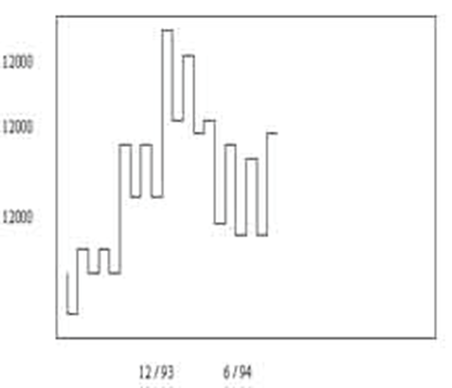

绘画方法上，可按照以下步骤： 

1) 当市场从低位上升，连续三天出现较高的底位及高位，图表上的线应移至第三天的高点。若市场下跌两天后第三天再创新高，则图表上的线应垂直上移至当天的高点。

2) 当市场连续三天创新低时，图表的线便可下移至第三天低位的水平，若市场继续下跌，则可将图表上的线垂直下移至当天的低点。

3) 若市场连续三天创新高点，则“三天图”表便可回升。  

###### 2)用幅度决定市势的趋向

上升市回档跌幅超过九点，可能转势下行；下跌市，反弹超过九点，可能转势上行。

恒生指数九点图，每单位等于10点 

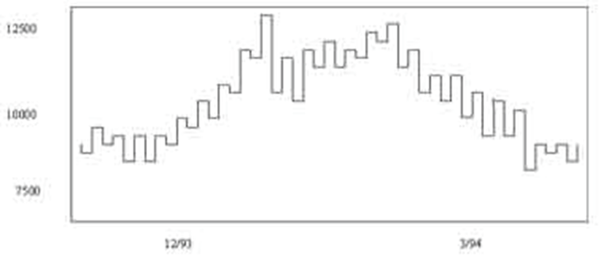

"九点平均波动图"的规则是： 

若市场在下跌的市道中，市场反弹低于9点，表示反弹乏力。超过9点，则表示市场可能转势，在10点之上，则市势可能反弹至20点，超过20点的反弹出现，市场则可能进一步反弹至30至31点，市场很少反弹超过30点的。

对于上升的市道中，规则亦一样。 

江恩上述图表有几个特点需要注意：

1) 江恩的“三天图”是以时间决定市势的趋向，“九点图”则以价位上落的幅度决定市势的走向，双剑合壁。 

 2) 江恩的九点图，以统计为基础，实际应用“九点图”时，分析者必先了解所分析的市场，所取的幅度应以超过平均上落幅度50%为佳。 

##### 根据价格形态买卖

###### 1)在单底，双底或三底买入 

江恩第二条买卖规则十分简单，当市场接近从前的底部，顶部或重要阻力水平时，根据单底，双底或三底形式入市买卖。

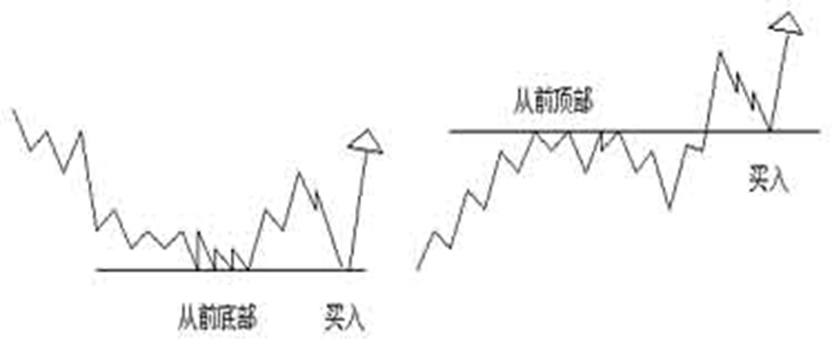

（1）市场从前的底部是重要的支持位，可入市吸纳。

（2）当突破从前的顶部时，则阴力成为支持，当市价回落至该顶部水平或稍低于该水平，都是重要的买入时机。

-----------------------------------------------------------------------------------------------------------------------------------------------------------

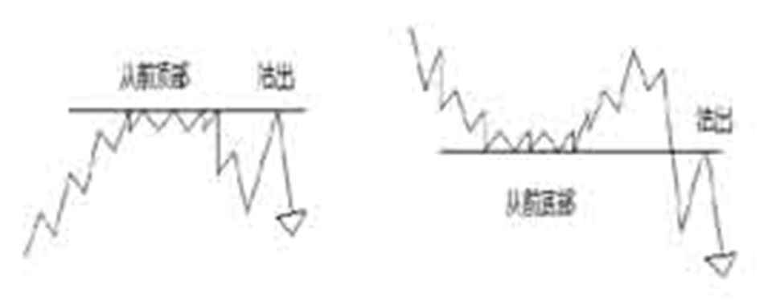

​       相反而言，当市场到达从前顶部，并出现单顶，双顶以至三顶，都是沽空的时机。此外，当市价下破从前的顶部，之后市价反弹回试该从前顶部的水平，都是沽空的时机。 

###### 2)根据百分比买卖

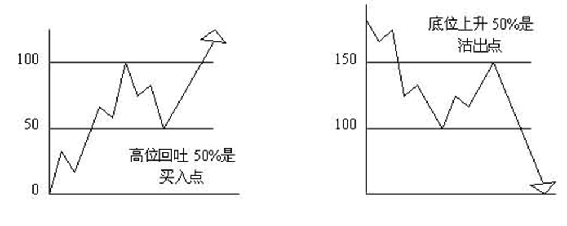

第三条买卖规则，乃是根据百分比买卖。江恩认为，只要顺应市势，有两种入市买卖的方法： 

1) 若市况在高位回吐50%，是一个买入点。 

2) 若市况在底位上升50%，是一个沽出点。

-----------------------------------------------------------------------------------------------------------------------------------------------------------

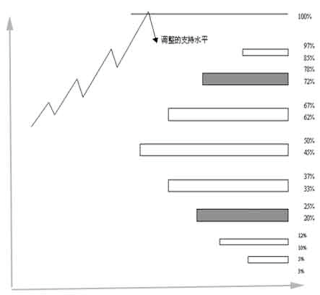

此外，一个市场顶部或底部的百分比水平往往成为市场的重要支持或阻力位，以下几个百分比水平值得特别留意。 1) 3~5%

2) 10~12%

3) 20~25%

4) 33~37% 

5) 45~50%

6) 62~67%

7) 72~78%

8) 85~87% 

在众多个百分比之中，50%，100%以及100%的倍数皆为市场重要的支持或阻力水平。

-----------------------------------------------------------------------------------------------------------------------------------------------------------

不过投资者要特别留意，若市场出现第四个底或第四个顶时，便不是吸纳或沽空的电动机，根据江恩的经验，市场四次到顶而上破，或四次到底而下破的机会会十分大。 

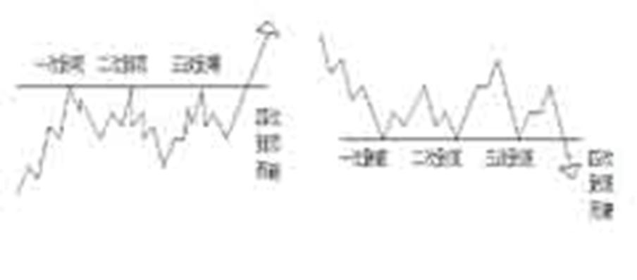

###### 3)市场分段运行

在升市中，市场通常会分为三段甚至四段上升的。在下跌趋势中，市场亦会分三段，甚至四段浪下跌的。   

当上升趋势开始时，永远不要以为市场只有一浪上升便见顶，通常市场会上升，调整，上升，调整，然后再上升一次才可能走完整个趋势；反之，在下跌的趋势中亦一样。

江恩这个对市场走势的看法与艾略特的波浪理论的看法十分接近。不过，对于一个趋势中究该应该有多少段浪，江恩没有艾略特般硬性规定下来，江恩认为在某些市场趋势中，可能会出现四段浪。 

究竟如何去处理江恩与艾略特之间的不同看法呢？一般认为有三种可能：

1) 所多出的一段浪可能是低一级不规则浪的b浪。 (左)

2) 所多出的一段浪可能是形态较突出的延伸浪中一个。 （中）

3) 所多出的一段浪可能是调整浪中的不规则b浪。  （右）

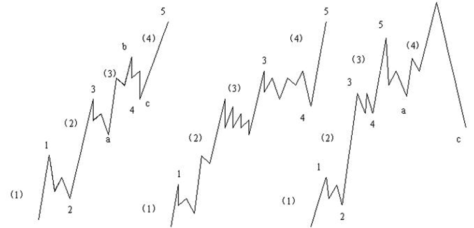

###### 4）利用五至七点波动买卖

1) 若趋势上升，则当市场出现5至7点的调整时，可趁低吸纳，通常情况下，市场调整不会超过9至10点。 

2) 若趋势向下，则当市场出现5至7点的反弹时，可趁高沽空。 

3) 在某些情况下，10至12点的反弹或调整，亦是入市的机会。 

4) 若市场由顶部或底部反弹或调整18至21点水平时，投资者要小心市场可能出现短期市势逆转。 

江恩的买卖规则有普遍的应用意义，他并没有特别指明是何种股票或哪一种金融工具，亦没有特别指出哪一种程度的波幅。这种分析金融市场的方法是十分特别的。 

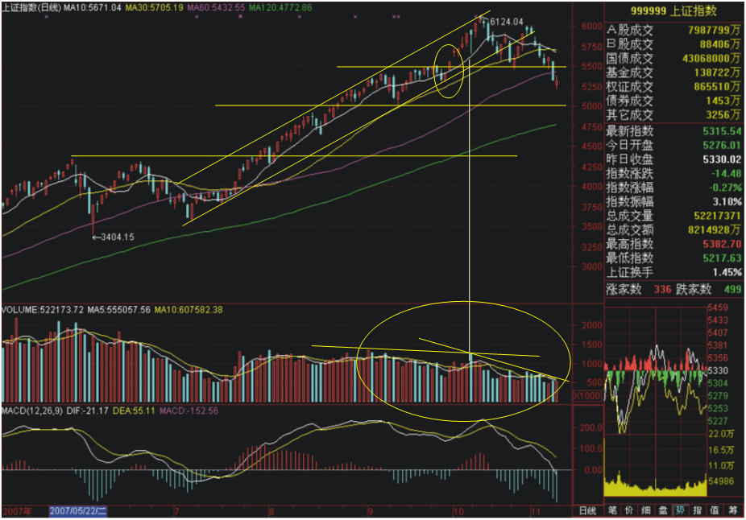

###### 5）最安全的买卖点

在市场获利，除了能够正确分析市场走势外，出入市的策略亦是极为重要的，若出入市不得法，投资者即使看对市仍不免招致损失。  

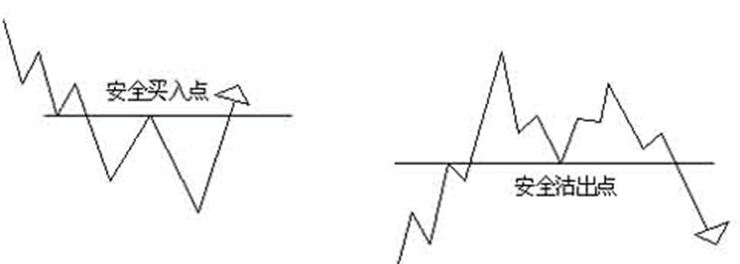

  市场上破之前高点，是安全买入点；市场下破之前低点，是安全沽出点。 

江恩对于跟随趋势买卖，有以下的忠告：

1） 当市势向上的时候，追买的价位永远不是太高。 

2） 当市势向下的时候，追沽的价位永远不是太低。 

3） 在投资时紧记使用止蚀盘以免招巨损。 

4） 顺势买卖，切忌逆势。 

5） 在投资组合中，使用去弱留强的方法维持获利能力。 

根据江恩的研究，在一个快速的趋势中，市价逆市反弹或调整，通常只会出现两天，是一个判断市势的有效方法。 

**江恩回调法则** 

回调是指价格在主运动趋势中的暂时的反转运动。回调理论是江恩价格理论中重要的一部分。 

根据价格水平线的概念，50%、75%、100%作为回调位置是对价格运动趋势的构成强大的支持或阻力。 

例如：某只股票价格从40元最高点下降到20元最低点开始反转，价格带的空间是40元减去20元为20元。这一趋势的50%为10元，即上升到30元时将回调。而30元与20元的价格带的50%为5元，即回调到25元时再继续上升。升势一直到40元与20元的75%，即35元再进行50%的回调，最后上升到40元完成对前一个熊市的100%回调。 

那么，如何判断峰顶与峰底呢？江恩认为一年中只做几次出色的交易就可以了，为此，需要观察以年为单位的价格图，来决定一年中的顶步与底部，然后才是月线图、周线图和日线图。 

**江恩50%回调法**   

江恩50%回调法则是基于江恩的50%回调或63%回调概念之上。 

江恩认为：不论价格上升或下降，最重要的价位是在50%的位置，在这个位置经常会发生价格的回调，如果在这个价位没有发生回调，那么，在63%的价位上就会出现回调。 

在江恩价位中，50%、63%、100%最为重要，他们分别与几何角度45度、63度和90度相对应，这些价位通常用来决定建立50%回调带。 

投资者计算50%回调位的方法是：将最高价和最低价之差除以2，再将所得结果加上最低价或从最高价减去。 

当然，价格的走势是难以预测的，我们在预测走势上应该留有余地，实际价格也许高于也许低于50%的预测。 江恩投资实战技法适合于各种时间尺度的图表，包括5分钟图、日线图、周线图、月线图和年线图。 

江恩投资实战技法适合于各种时间尺度的图表，包括5分钟图、日线图、周线图、月线图和年线图。 

##### 根据成交量买卖

市场成交量 

第一，当市场接近顶部的时候，成交量经常大增，大成交量经常伴着市场顶部出现。 

第二，当市场一直下跌，而成交量续渐缩减的时候，则表示市场抛售力量已近尾声，投资者套现的活动已近完成，市场底部随即出现，而市价反弹亦指日可待。 

在利用成交量分析市场趋势逆转时，须结合以下因素分析。

1) 时间周期——成交量的分析必须配合市场的时间周期，否则收效减弱。 

2) 支持、阻力位——市场到达重要支持阻力位，成交量的表现配合见顶或见底的状态，市势逆转的机会增加。 

**成交量有助于决定市场见顶或见底。大成交量通常表示见顶，低成交量通常表示见底。**    

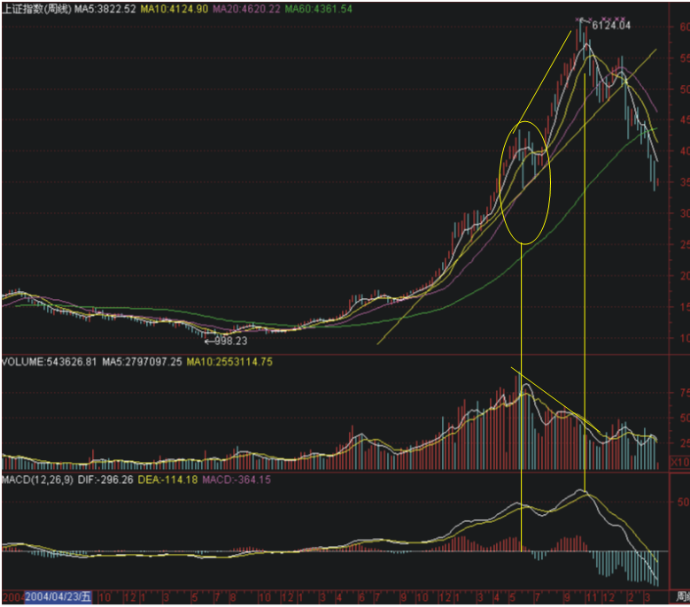

#### 三 江恩21条操作守则

买卖规则重于预测！ 这就是江恩获胜的真正秘诀

１、每次入市买、卖，损失不应超过资金的十分之一。 

２、永远都设立止损位，减少买卖出错时可能造成的损失。 

３、永不过量买卖。 

４、永不让所持仓位转盈为亏。 

５、永不逆市而为。市场趋势不明显时，宁可在场外观望。 

６、有怀疑，即平仓离场。入市时要坚决，犹豫不决时不要入市。 

７、只在活跃的市场买卖。买卖清淡时不宜操作。 

８、永不设定目标价位出入市，避免限价出入市，而只服从市场走势。 

９、如无适当理由、不将所持仓平盘，可用止赚位保障所得利润。 

１０、在市场连战皆捷后，可将部分利润提取，以备急时之需。 

１１、买股票切忌只望分红收息。（赚市场差价第一） 

１２、买卖遭损失时，切忌赌徒式加码，以谋求摊低成本。 

１３、不要因为不耐烦而入市，也不要因为不耐烦而平仓。 

１４、肯输不肯赢，切戒。赔多赚少的买卖不要做 

１５、入市时落下的止损位，不宜胡乱取消。 

１６、做多错多，入市要等候机会，不宜买卖太密。 

１７、做多做空自如，不应只做单边。 

１８、不要因为价位太低而吸纳，也不要因为价位太高而沽空。 

１９、永不对冲。 

２０、尽量避免在不适当时搞金字塔加码。 

２１、如无适当理由，避免胡乱更改所持股票的买卖策略。 

#### 四 操盘手建仓八大铁律

1、永远要分批建仓，不得满仓操作。

2、第一仓位不得超过总资金的30%。

3、不得在连续上涨超过15%的点位追高建仓。

4、第一仓位如果亏损不得加仓，盈利后方可逢低加仓，且亏损超过10%必须止损。

5、若盈利超过20%，加仓比例不得超过总资金的30%。

6、仓位资金获利20%以上后，仓位才能超过80%。

7、永远不要逆市建仓和加仓。

1、同一账户5000万以下资金持仓不得超过3支股票。

2、建仓资金获利未超过10%，不得进行高抛低吸。

3、每次高抛低吸资金不得超过已建仓位的20%。

4、波段持有，趋势不破，不得平仓，让利润奔跑。

5、永远不要一次性平仓，除非出现系统性风险。

6、永远不要抛出加速上涨的股票，直至出现明显滞涨为止。

7、突发事件，冷静处理。

8、不得频繁换股，不得频繁操作。

1、永远不要让总资金亏损超过10%。

2、上升趋势的阶段性调整，仓位不得超过50%。

3、每一单都要预先设好止损位，跌破止损位坚决止损。

4、永远不要去主观预测市场，一定要客观顺应市场。

5、大盘为重，个股为轻，有80%以上获利概率方可入市。

6、上涨空间有30%以上可能性，方可介入。

7、不得参与高位出货股进行短线高风险操作。

8、资金就是生命，失去资金操盘生涯就此结束。