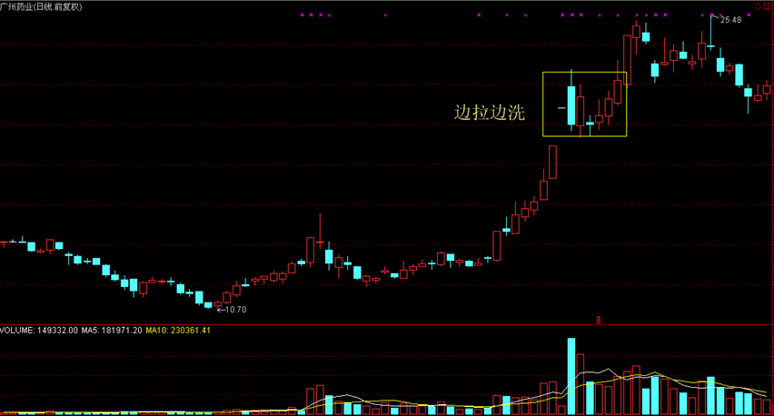

[TOC]

[庄家分析](#庄家分析)

[主力坐庄过程](#主力坐庄过程)

[主力坐庄风格](#主力坐庄风格)

[庄家运作流程](#庄家运作流程)

[主力吸筹手段](#主力吸筹手段)

[主力洗盘手段](#主力洗盘手段)

[主力拉升手段](#主力拉升手段)

[主力出货手段](#主力出货手段)

##### 庄家分析

庄家是股市的一个特殊群体，他们掌握着至少可以左右一只个股的资金实力，通过主动影响股价实现其自身的赢利。庄家现象在不成熟股市中表现得更为突出。但另一方面，庄家是市场的活跃因素，庄家使得股价暴涨暴跌，即给中小投资者带来风险，也同时带来机会。

##### 主力坐庄过程

主力的做庄是从进货开始的，其后经过洗盘、拉抬、整理、拔高、出货，完成一轮炒做。这是个标准的做庄过程，但不是所有庄股都做的那么清晰，主力常常省略其中的某一些阶段，以使其行为变得更为隐蔽。比如他可以进货后直接拉抬，目标位一到就出货。但无论如何，进货和出货总应该是有的。

##### 主力坐庄手段

**1 发掘题材**

“据市场传闻，该股有三大利好题材…….”，这是我们很熟悉的股评语言。

主力做庄，第一步是挖掘题材，而后吸筹，再有计划的将题材公布于众。

当少数圈内人获知这些题材时，还真是灵验的。于是形成挣钱示范效应，这条消息通道也随之被认为是黄金隧道。最后大量的消息从这条隧道中涌出，主力也就有了出货条件。

**2 制造概念**

形成概念是人脑的机能，不幸的是，股市中的人们常常被一个概念套牢。

我们经常听到的四万亿投资概念、新能源概念、国际版概念、新能源概念、生物医药概念等等，肯定会无一例外的把大批的股民套在高位。股市的概念是一种广告效应，当一个概念被市场炒热的时候，您说这时庄家该做什么了呢？

**3 激发想象**

中国人崇尚眼见为实，如果您说服一个企业家投资一个项目，他常常要您拿出一篇长长的可行性报告，必要时您还要使用点公关手段。但股市中不用，我们常听股评家说，该股想象空间巨大。就是说，股市凭想象就有人投资。如果街上一个卖豆腐脑的，忽然某天改卖电脑了，您能想象得出他能赚到钱吗？但如果这个卖豆腐脑的是个上市公司，问题就不同了，它就有了巨大的想象空间！想象空间对于主力来说是必不可少的。没有了想象空间，他的货还能卖给谁呢？

**4 形成规律**

股市的规律有时候是人造的。

比如主力吸筹，他可以让一只股形成有规律的上下震荡，每一次冲高都是卖出机会。而当人们真的逢高卖出时，主力则通而吃之。单边上扬也是一种规律，什么时候卖都是错的。当2007年人们大叫死了都不卖的时候，结果全被高位套牢了。有时股价忽然回调，当大家正在担心时，股价又创新高。过几天又回调，结果没跌多少又涨了。看来每一次回调都是进货机会。真的是吗？下一次回调试着进货吧，那时您就知道厉害了。

 这就叫市场心理训练。反复形成同一个规律，当市场形成共振时，有人就要倒霉了。

##### 主力坐庄风格

人跟人不一样，庄跟庄也不一样。

按照吸筹、洗盘、拉抬、整理、拔高、出货的程式的做庄风格叫标准庄。很有些学院派风格。

但有人不这么干，高位吸筹，迅速拉抬，坚决出货。行情来得快，来得猛，去得也急。主力一进一出，用了大量的价格空间，自己只能挣其中一部分。

也有些股长期做慢牛行情，常出现在一些绩优股上，这些主力认为自己在做投资，完成个股的价值发现。他们很象牧场主，养了一群牛，我们可以叫他们牧牛庄，不过要注意，牧牛人养牛不是为了好玩，牛总要养大，养大了就… ...。

也有养鸡的，隔一段时间给主人下个蛋。这类股的走势是大幅 度震荡，主力做高抛低吸。同样，鸡不是总有那么高的产蛋率，如果这只鸡下蛋困难了，要么养肥点卖了，要么直接杀了吃肉。

准确判断庄家性质，不要用买一只牛的价钱买了只鸡。

##### 庄家运作流程

一、吸筹阶段

庄家吸筹是指在股市中庄家介入某一个股，一段时间内不断买入建仓或加仓的行为。

二、洗盘阶段

庄家洗盘是指庄家为达到炒作目的，必须于途中让低价买进，意志不坚的散户抛出股票，清理市场多余的浮动筹码，以减轻上档压力.让持股者的平均持仓成本升高，以利于施行做庄的手段，达到牟取暴利的目的。在实际的高抛低吸中，庄家也可兼收一段差价，以弥补其在拉升阶段将付出的较高成本。

三、拉升阶段

庄家的资金、时间和精力都是为了拉升而付出，主力建仓、洗盘、试盘等所有的工作都是围绕拉升而展开。如果没有拉升带来的暴利，就不会有庄家的前赴后继。因此，庄家最为重视拉升这个环节。

四、出货阶段

庄家出货是指庄家在拉高股价后，有计划、有策略地，或者分批或者集中性卖出股票的行为。

##### 主力吸筹手段

###### **1.打压吸筹**

打压吸筹是指庄家在某个价位收集少量筹码，然而利用各种手段对股价进行不计成本的打压，使股价短期内产生暴跌，在相对低位收集大量筹码。打压吸筹主要在大盘下跌或横盘整理过程中进行。

###### **2.振荡吸筹**

 震荡吸筹是指庄家为了获得足够数量和合理价格的筹码，又尽量不引人注意，将股价控制在一定的区间范围内，通过反复、长期震荡，消磨投资者的耐心，在相对低位收集筹码。

###### **3.拉高吸筹**

 拉高吸筹是指庄家为了能够在短期内获得足够数量的筹码，不计成本，通过快速拉升股价的方式让利于投资者。当短期涨幅达到一定幅度时，很多投资者快速获利而卖出，庄家趁机买入，以获得筹码。这种走势的前提条件是，股价在低位多重驻底，而低位中公众持筹量较大，庄家在低位吸不到满足的筹码，只能拉高。但一定会激烈震荡，使低位进场但心态又不稳定的投资者离场，减少了未来拉升中的抛压，也吃到了筹码。

##### 主力洗盘手段

股价突破后主力常常有洗盘行为，因为主力不愿意那些短线的不坚定分子在未来的走势中搅局。股价涨到一定程度时会有获利回吐，庄家也会为减轻将来拉升中的抛压，顺势打压，这也是震仓洗盘。

###### **1.打压式洗盘**

直接打压多出现在庄家吸货区域，目的是为了吓退同一成本的浮动筹码。

在盘中表现为开盘出奇地高，只有少许几笔主动性买单便掉头直下，一直打到前一日收盘价之下，持仓散户纷纷逢高出局。打压洗盘方法的好处在于快和狠，采用时间较短，而洗盘的效果较好。

###### **2.横盘整理式洗盘**

横盘整理式洗盘是指庄家以横盘整理的方式进行洗盘。横盘的目的是利用投资者缺乏耐心的弱点，用时间来消磨其斗志和信心。当股价长时间横盘后，就会令不少获利者先落袋为安，离场出局，从而达到洗盘的目的。

###### **3.边拉边洗式洗盘**

边拉边洗式洗盘是指通过拉高股价，待有一定的累积升幅以后，放手任股价滑落，由于股价的升幅较大，势必带来获利盘的涌出，待获利盘套现压力减缓以后，庄家再度拉升。边拉边洗式洗盘可以在拉升过程中及时解决盘中的浮筹。

如果能正确判断主力洗盘，那在操作上就占据了主动权。洗盘是一种骗线，一旦被识破，主力则在一定程度上被动了。当然，主力一般可以完成洗盘计划，因为识别主力洗盘是非常复杂的技术。

##### 主力拉升手段

在准确判断主力吸筹，又在主力洗盘时保住了仓位，一旦主力终于开始拉升，大家多少可以松半口气了。

散户常常出现的错误操作是刚刚获利就轻易抛出了。这种以自己是否赢利来决定买卖是错误的,因此要理解主力的拉抬过程。

###### **1.判断主力的持仓量**

做一个庄到底需要垄断多少筹码？做过操盘手的朋友告诉我们，一个短线炒做需要控制20%以上的流通盘，中级波段式炒做需吃下50%左右的筹码。从技术分析上虽不能估计主力的精确仓位，但至少可以定性的知道主力是巨量持仓还是少量持仓。

主力控盘的标志是市场满盘获利而股价不跌。

股价低位向上突破后连续上扬，也是主力控盘的标志，这是一种极强的走势。另一种情况，是突破后回调，只要股价不破筹码密集峰的支撑，也是主力控盘的特征。

###### **2.主力的拉抬方式**

在不同的仓位状况下，主力做一次中级幅度的拉升，可采用两种拉抬方式：锁仓拉抬及对倒拉抬。

**锁仓拉抬**，就是主力先吃下大量筹码，把盘子搞轻，随后只用不多的成交量就可以把股价拉抬上去。锁仓拉抬方式对于主力来说是出货困难，因为他的货太多。但对于跟庄操作来说反到是件好事，您不急于获利就走，反正主力走不了。

**对倒拉抬**，股价同移动筹码同步上升。主力之所以对倒，主要是因为他持仓量不足。主力对倒拉抬的股，其行情所持续的时间不长，但上升猛烈。一旦趋势线被破坏，或者筹码高位密集，就可以出货了。

具体来看，主力拉升常用手法有以下几种：

###### **1.快速式拉升**

快速式拉升是指庄家在极短的时间内将股价拉升到目标位，期间基本没有调整。快速式拉升主要应用于大盘走势良好的时候，其走势完全独立于大盘。

快速式拉升常采用连续大阳线或者涨停阳线推高股价，突出快、准、狠的特点，刻意制造井喷式行情，从而吸引跟风盘。

###### **2.台阶式拉升**

台阶式拉升是指在股价上涨了一定幅度后，采取平台或强势整理的方式调整，待清洗掉浮筹后再度拉升，拉升到一定价位再次整理，如此反复，直至将股价拉升至目标价。台阶式拉升适用于庄家实力较强、运作项目基本面优良、后市存在重大题材的大盘绩优个股。台阶式拉升讲究稳扎稳打。台阶式拉升还有一大作用，就是稳定投资者情绪。

###### **3.振荡式拉升**

振荡式拉升主要采取低吸高抛的方法，以波段操作获取利润差价为目的，以时间换取空间为手段进行运作。在K线走势图上，表现为低点和高点逐步上移，走出比较规律的宽幅上升通道。庄家可在上升通道的下轨积极吸纳筹码，在上升通道上轨附近抛售。通过这种反复低吸高抛获取丰厚的利润。振荡式拉升主要适用于基本面无重大题材或者庄家资金不够充裕、实力较差的股票。

###### **4.边拉边洗式拉升**

边拉边洗式拉升是指拉升过程一气呵成，中间没有比较明显的大幅度洗盘动作。边拉边洗式拉升绝大多数采用依托均线的方式进行，股价在上涨过程中始终不过度远离均线。庄家拉升思路明确，股价走势轨迹明显，常常走出单边上扬的独立上升态势。当主力开始大幅度洗盘之际，就是拉升行情结束之时。

**庄家的目标位**

判断庄家的目标位是困难的。盘子在人家手中，操盘手随时又可以改变计划。但在某些情况下，我们可以知道在某些位置上是主力最佳的出货点，这个位置可以大致确定为主力的目标位。

首先说一个定理：主力不可能在散户的出货位置上出货。什么是散户的出货位，就是那些明显的利空价位。如天价位，明显的压力线的位置，前期套牢阻力位。主力出货最怕惊扰了散户，如果这个地方天生就要散户准备出逃，主力一般要回避这些位置。

##### 主力出货手段

主力进货不容易，出货更难。主力出货一般都要大盘或消息面的配合。但简单的认为消息出台股价一定就跌也不对，因为这个规律一旦形成也会作废，因为它是个简单规律。所以，在技术上研究主力的出货是必要的。

常规的判断主力目标位，可以首先看主力成本上方的30%,看看那里主力是否可以出货，如果不能，主力则必须进一步拉高，直到某个没有散户的集中抛盘，甚至是某个可以激发散户无穷的想象的位置。

行情的最终目标位决定于主力的状况和行情的性质。操作中不能拘泥于这个目标位，一旦行情出现异常，或者主力逃庄，该走还是要走的。

主力的行为有其必然的逻辑。这是因为主力的最终目的是获利。这就是我们说的市场约束。主力至少不愿意做使其亏损的事，于是也就使我们有了估计其下一步动作的可能。

**主力出货的常见K线形态**

在K线上，主力出货会在出货时留下一些痕迹。常见的是熊长牛短和绿肥红瘦。熊长牛短是主力缓缓派发，股价慢慢下跌，但跌至某个支撑位又被主力快速拉起，随后再走慢熊的N形走势。绿肥红瘦是某段时间K线上大量的阴线，只有少量阳线的K线组合形态。

K线组合形态对识别主力出货有一定的帮助。但仅靠K线是不够的。

###### **1.振荡式出货**

 振荡式出货是采用振荡的手段来掩饰主力派发的痕迹。换言之，就是要在派发手中筹码的同时，还要维持较高的人气。在振荡式出货的末期，由于主力派发的行为，导致整个形态演变的过程中浮码越来越重，最终选择向下突破，从而演变为头部形态。

###### **2.横盘式出货**

横盘出货以派发为主要目的，主力常常做出各种突破姿态，引诱跟风盘，但随着主力不断派发，盘面浮码日趋沉重，股价走势也日趋疲软，从成交量的角度来看，在整个形态演变的过程中成交量能较活跃，始终不萎缩

###### **3.打压式出货**

打压式出货多为庄家出货末期出现的走势。从盘面上来看，虽然也是快速下跌，但盘中多有反弹，以吸引买盘跟进，同时稳定套牢者之持股信心。股价总体走势呈逐波下探之势，重心快速下移，在日K线上往往形成长阴线。

###### **4.拉高式出货**

主力利用个股利好或者传闻，在上档每相隔数个价位放上大笔卖单，趁人气鼎盛时，自己率先快速小批量买进，引诱跟风盘蚕食上档卖单，在股价快速上涨的过程中，不知不觉地将筹码转换到中小投资者手中。

###### **5.涨停板出货法**

主力将股价拉高后进入加速上扬阶段，出现飚升行情，使观望的跟风盘忍受不住股价快速上涨的诱惑，原来获利的跟风盘也由于利润的快速增值而产生惜售的心理。

主力以巨量的买单，将股价封至涨停，然后主力悄悄撤出挂在前列的买单，然后再将这些买单继续挂在跟风盘的后面，用小批量的卖单，逐步将手中的筹码过渡给排列在第一时间段内的散户投资者。

###### **6.利用题材、业绩、利好出货**

高业绩出货法是指使用财务手段或者投资收益手段把上市公司的业绩公布得特别的好，利用股价送股除权后公布，先涨后跌达到出货的目的。大题材出货法是在股票价格已经高了，先高比例送股，后改个适合当时热点的名字，其后送一个特别大的利好，紧接着出货。

