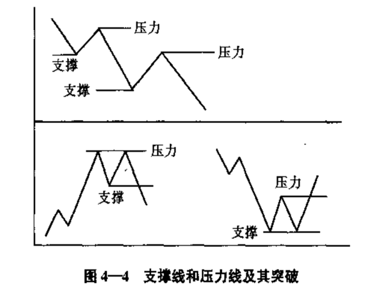
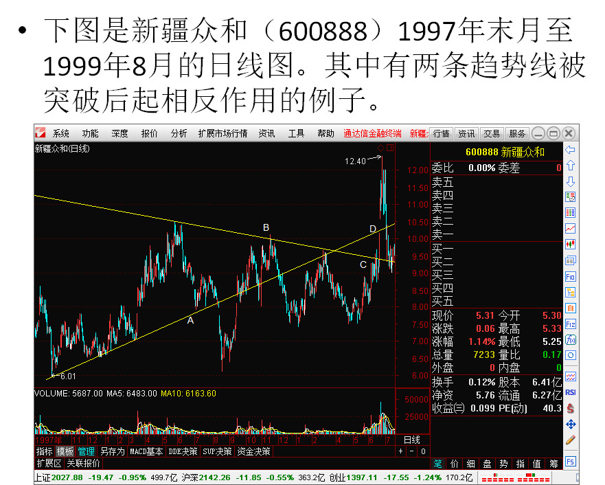

[TOC]

[趋势的定义](#趋势的定义)

[趋势的方向](#趋势的方向)

[趋势的类型](#趋势的类型)

[支撑线和压力线](#支撑线和压力线)

[趋势线](#趋势线)

历史的发展过程告诉我们，只有顺应时代的潮流，改变原来不正确的观念，才能兴旺发达。证券市场也有顺应潮流的问题。要“顺势而为”，不“逆势而动”，已成为被广泛接受的投资证券的准则。一个证券投资者如果不懂得这一点，其后果将是非常可怕的。即使一时取得成功，但维持的时间不可能长久，最终必将招致重大损失。

要准确地把握形势，了解大势的发展方向，判断是上升还是下降，是暂时上升马上就会下降，还暂时上升不会马上下降，做到这一点是很困难的。大势的发展变动并不是简单的上升下降，由于各种原因，在七升和下降的过程中要经过许多曲折。也就是说，上升的趋势中会有下降，下降的趋势中含有上升。这就给投资者的判断造成很大的麻烦，容易在究竟是暂时反弹或回档，还是彻底转势这个问题上出现失误。

本文从对趋势的认识着手，应用有关支撑压力的分析方法，帮助投资者提高识别大势是继续维持原方向还是掉头反向的能力。当然，支撑压力的切线法主要是给出一些方法，这些方法一般只能提供参考意见。获得“正”收益的前提是对投资分析方法的合理、正确使用。

比较早从理论上对支撑压力进行完整的叙述，出现在1948年出版的由爱德华和马吉所著的《Technical Analysis of Stock Trends》。在这本书中，其作者对支撑压力的本质性的内容进行了较为系统全面的说明。举出了大量的是股票市场中的实际例子。其阐述的方式非常的细致，甚至可以说达到了“罗唆”的地步。

#### 趋势的定义

证券的市场价格随时间的推移，在图表上会留下自己的痕迹。这些痕迹会呈现一定的方向性。这样的方向反映了价格的波动情况。

趋势就是价格波动的方向，或者说是证券市场运动的方向。若确定了当前市场是一段上升（或下降）趋势，则价格的波动就是向上（或向下）运动。当然，在上升的趋势里，肯定会出现下降的过程，但这不是主流，不影响上升的大方向。不断出现的新的高价会使偶尔出现的小幅度下降黯然失色。在下降趋势中，情况正好相反，不断出现的新的低价会使投资者心情悲观失望人心涣散。

技术分析的三个假设的第二条明确说明价格的变化是有趋势的，没有特别的理由，价格将沿着这个趋势继续运动。这一点就说明趋势这个概念在技术分析中占有很重要的地位，是分析人员应该注意的核心问题。

一般说来，市场变动不是朝一个方向直来直去，中间肯定要出现曲折。从图形上看就是一条蜿蜒曲折的折线，每个折点处就形成一个峰或谷。从这些峰和谷的相对高度上，我们可以看出趋势的方向。

#### 趋势的方向

趋势有三种方向：

- 上升方向（up trend）
- 下降方向（down trend）
- 水平方向（sideway）: 无趋势方向

在实际的投资行为中，重点关心的是上升和下降方向。

价格的波动在图表中会形成一些“峰（peak）”和“谷（trough）”。从直观上看，如果价格波动图形中的后面的峰和谷都高于前面的峰和谷，那么趋势就应该属于上升的方向。这就是常说的“一底比一底高”，或“底部抬高”。如果图形中后面的峰和谷都低于前面的峰和谷，那么趋势就应该是下降方向。这就是常说的一顶比一顶低，或顶部降低。

如果价格图形中后面的峰和谷与前面的峰和谷相比，没有明显的高低之分，几乎呈水平延伸，这时的趋势就是水平方向。水平方向趋势是容易被大多数投资者忽视的一种方向。这种方向在市场上出现的机会是相当多的。就水平方向本身而言，也是极为重要的。大多数的技术分析方法在处理水平方向的市场的时候都容易出错，或者说作用不大。这是因为这时的市场正处在供需平衡的状态，下一步朝哪个方向运动的偶然性很大，没有规律可循。可以向上也可以向下，而对这样的对象去预测它朝何方运动是极为困难的，也是不明智的。随机漫步理论正是基于此种情况而提出的。

#### 趋势的类型

第一种趋势类型是主要趋势（primary trend）。主要趋势是趋势的主要方向，是证券投资者极力要弄清楚的目标。了解了主要趋势后才能做到顺势而为。主要趋势是价格波动的大方向，持续的时间一般比较长。技术分析三个假设中的第二个假设说明这个这一点。

第二种趋势类型是次要趋势（second trend）。次要趋势是在进行主要趋势的过程中进行的调整。我们知道，趋势不会一成不变地直来直去，总有局部调整和回撤的过程，次要趋势正是完成这一使命。

第三种趋势类型是短暂趋势（near term trend）。短暂趋势是在次要趋势的过程中所进行的调整。短暂趋势与次要趋势的关系就如同次要趋势与主要趋势的关系一样。

这三种类型的趋势的最大区别是时间的长短和波动幅度的大小上的差异。以上三种划分可以解释绝大多数的行情。对于更复杂的价格波动过程，以上三种类型可能还不够用。不过这不是很大的问题，可以继续对短暂趋势进行再细分。图4-2是三种趋势类型的图形说明。

##### 一个实际的趋势图

图4-3是上证指数从1994年7月至2000年7月的实际走势的日线图。从图中可以看出，大趋势中有中趋势，中趋势中有小趋势。经过5年的时间，上证指数从325点上升到1756点。总的过程是上升，这是主要趋势方向。但是，从1994年9月的1050下降到1996年1月的510点，以及从1997年5月的1510点下降到1999年5月的1050点是次要趋势，它是对主要趋势的调整。在次要趋势的过程中还有很多短暂趋势。由于图中短暂趋势起伏的幅度不大，短暂趋势的过程不明显。

#### 支撑线和压力线

认清趋势是进行投资的重要步骤。认清了趋势之后，就应该采取相应的行动。例如，如果认识到大牛市已经来临，那么就应该进人市场进行实际的投资。这时将面临一个选择入市时机的问题。每个投资者都希望在大涨之前的低点买入，或者在涨势的中途回落的低点买入。这些低点在哪里呢？对这些问题肯定没有十全十美的答案，但是支撑线和压力线会给我们以一定的帮助。

**1．支撑线（support）**

支撑线又称为抵抗线。当价格下降到某个价位附近时，价格停止下跌，甚至有可能还有回升，这是因为多方在这个位置买入造成的。这个位置对价格继续下降起了迟滞作用。这个阻止证券价格继续下降或暂时阻止价格继续下降的价格位置就是支撑线所在的位置。

**2．压力线（resistance）**

压力线又称为阻力线。当价格上涨到某价位附近时，价格会停止上涨，甚至回落，这是因为空方在此抛出造成的。压力线所在的位置阻止价格继续上升。这个起着阻止或暂时阻止价格继续上升的价位就是压力线所在的位置。

不要产生这样的误解，认为只有在下跌行情中才有支撑线，只有在上升行情中才有压力线。其实，在下跌行情中也有压力线，在上升行情中也有支撑线。由于在下跌行情中投资者最关注的是价格下跌到什么地方刁‘能结束，关心支撑线就多一些；在上升行清中人们更关注价格上涨到什么地方，所以关合压力线多一些。

##### 支撑位置和压力位置的简单判断

在实际的投资活动中，最简单的同时也是最常用的判断支撑压力位置的方法是，价格在前期的波动过程中所留下的局部的高点和低点，以及价格的成交密集区。所谓“成交密集区”是一个定性的说法。它所描述的是价格在波动过程中在某个特定的位置附近所持续的时间比较长，或者在这个特定位置出现的时候多，进而认为在这个特定位置附近的成交量比较多，交易比较活跃。

支撑压力的判断是进行投资决策的依据。最初的支撑线和压力线就是简单的指出价格位置。在后来的投资实际中发现，这样做有很多的片面性，不能满足实际的需要。很显然，我们在实际中不可能确切的知道实际的支撑在什么位置，如果简单地指出一个价格点是不符合实际的，因为价格在这个价格点出现停顿的“几率”很低。之后，投资在在运用的时候对支撑线和压力线的概念进行了发展。最重要的“改进”是将支撑和压力的概念从一个“价格点”扩大成了一个“价格区域”，即，某个价格附近出现停顿。

##### 支撑线和压力线的作用

如前所述，支撑和压力线会阻止或暂时阻止价格沿原来的方向继续运动。我们知道，价格的变动是有趋势的，要维持这种趋势，保持原来的变动方向，就必须冲破阻止其继续向前的障碍。要维持下跌行情，就必须突破支撑线的阻力和干扰，创出新的低点；要维持上升行情，就必须突破上升的压力线的阻力和干扰，创出新的高点。由此可见，支撑线和压力线有被突破的可能，它们不可能长久地阻止价格保持原来的变动方向，使之在一个区间永远的呆下去，只不过是使之暂时停顿而已。如图4-4中上半部分的图。

同时，支撑线和压力线又有彻底阻止价格沿原方向变动的可能。当一个趋势终结了或者说到头了，它就不可能创出新的低价和新的高价，这样支撑线和压力线就显得异常重要，是取得巨大利益的地方。当然，应该指出，“趋势终结”是相对的概念，不是绝对的。从经验上看，没有不可能被突破的高点，突破只是时间问题。

##### 容易出现压力和支撑的位置

| **心理层面**                         | **交易（技术）层面** |
| ------------------------------------ | -------------------- |
| 前高或前低                           | 交易密集区           |
| 缺口                                 | 移动平均线           |
| 大阳线或大阴线                       | 趋势线（斜线）       |
| 整数点位                             |                      |
| 特别数字点位（例如黄金分割数字位置） |                      |

在上升趋势中，如果价格下一次未创出新高，即未突破压力线，这个上升趋势就已经处在比较关键的位置了，如果再往后的价格又向下突破了这个上升趋势的支撑线，这就产生了一个趋势有变的很强烈的警告信号，通常这意味着，这一轮上升趋势已经结束，下一步的走向是向下跌的过程。同样，在下降趋势中，如果下次未创新低，即未突破支撑线，这个下降趋势就已经处于很关键的位置，如果下一步价格向上突破了这个下降趋势的压力线，这就发出了这个下降趋势将要结束的强烈的信号，价格的下一步将是上升的趋势，如图4-4下半部分图。

##### 支撑和压力的重要程度及判断原则

1. 一个区域阻止或使运行趋势发生反转的次数越多，则这个区域的重要程度就越高，作用力就越大。
2. 在压力位或支撑位前，股价运行的越剧烈， 这个区域的作用力就越大，其重要程度就越高。
3. 支撑或压力区域股票换手率越高，则作用力越强，相对也更重要。
4. 支撑或压力区域的时间越近，其作用力就越大；时间越远，其作用力就越小。
5. 支撑或压力被触碰的次数越多，其作用力就越小，被突破的可能性就越大。
6. 支撑和压力被突破后具有相互转换的特性。

**详细解释**

1.一个区域阻止或使运行趋势发生反转的次数越多，则这个区域的重要程度就越高，作用力就越大。这一方面在于人的心理，另一方面也有其技术含义。例如，股价在某一区域寻找到支撑后反弹，反弹结束回到这个位置再反弹，屡试不爽。那么，市场上的投资者就会习惯在这个区域买入，然后在更高的位置卖出，但最终股价不幸跌破这个区域，则所有在这个区域买入准备获利的投资者就会被迫赔钱卖出。他们的卖出会压低股价，这个时止损的投资者数量会增加，股价会运行的更低，这样就会恶性循环下去，直到下一个支撑点为止。客观上，这个支撑区域越长，就越被市场认为是合理的止损位，一旦这个支撑被击垮，则市场信心顿失，这就是为什么重要支撑垮掉后股价会快速下跌的重要原因。反过来，这个规则同样适用于压力位。

2.在压力位或支撑位前，股价运行的越剧烈， 这个区域的作用力就越大，其重要程度就越高。我们举个例子来说明这个原则。下图显示了华北制药（600812）在2008年2月—2008年5月的一段走势。首先，在2月份之前有一个下行缺口，在其之后大盘下跌，中间有反弹，但被缺口压力和长阴线压力给压回，最终反弹失败而暴跌。随后，股价在4月下旬展开反弹，反弹速度很快，短时间有了近一倍的增幅。但如图所示，无论是缺口还是密集交易区内的压力都很大，最终股价向上的态势被压回而下跌。这个图形充分说明了再剧烈波动后压力或支撑作用力更强的原则。

3.支撑或压力区域股票换手率越高，则作用力越强，相对也更重要。举个例子，比如某个股票在10元处有大量的换手，之后股价向下运行到了7元，当股价再次回到10元时那些被套的投资者一定会有兑现冲动。反之，股价在10元获得高换手率，当股价上涨到12元后再回到10元，那些原来在10元买入的投资者从获利再回到原点由于心有不甘就会惜售，最终因为卖盘减少而获得较强支撑。

4.支撑或压力区域的时间越近，其作用力就越大；时间越远，其作用力就越小。比如半年前的密集交易区的压力或支撑就比3年、5年前的作用力要强。时间越长，原密集交易区换手的筹码变化率就越大，那么在这个区域的买卖盘也就会出现变动，其支撑或压力作用当然就会降低。这与物品的保质期是一样的道理。不过，由于市场心理的作用，有时一个数年甚至十几年前的压力或支撑依然有较强的作用力。

5.支撑或压力被触碰的次数越多，其作用力就越小，被突破的可能性就越大。一般情况下，压力最多被触碰四次就会突破，当然也有触碰一次就突破的情况；而一旦支撑被跌破，这样的触碰一般很难超过三次。这种现象也很好理解，当一个压力或支撑被多次触碰，说明市场突破这个支撑或压力的欲望越强，频繁多次触碰说明内在力量正在聚集，这样次数越多被突破的可能性就越大。

6.支撑和压力被突破后具有相互转换的特性。股价跌破支撑，则支撑会转换为压力；当压力被突破，则压力就会变成支撑。支撑和压力这种变化主要是由于市场心理的作用。例如，某个股票在10元的位置的压力被突破，在突破过程中原来一部分被套用户会解套出局，而没有卖出的投资者看到获利就会更愿意持股，再加上新进筹码，那么支撑力量就会更强。这样一来，压力就变成了支撑；反之亦然。

##### 支撑线和压力线的相互转化

支撑线和压力线考虑了投资者的心理因素，两者的相互转化也是从心理方面考虑的。支撑线和压力线之所以能起支撑和压力作用，很大程度是由于心理因素的原因，这就是支撑线和压力线理论上的依据。当然，心理因素不是惟一的依据，还可以找到别的依据，但心理因素是主要的理论依据。

一个市场是无外乎三种人，多头、空头和旁观者。旁观者的又可分为持股者的和持币者两种。假设价格在一个支撑区域停留了一段后开始向上移动，在此支趋势线，轨道线，交叉线撑区买入股票的多头们很肯定认为自己买对了，并对自己没有多买入些而感到后悔。在支撑区卖出股票的空头们这时也认识到自己卖错了，他们希望价格再跌回他们的卖出区域时，将他们原来卖出的股票补回来。而旁观者中的持股者的心情和多头相似，持币者的心情同空头相似。无论是这四种人中的哪一种，都有买入股票成为多头的愿望。

正是由于这四种人决定要在下一个买入的时机买入股票，所以才使价格稍一回落就会受到大家的关心，他们会或·旱或晚地进人市场买入股票，这就使价格还未下降到原来的支撑位置，．上述四种新的买进大军就把价格推上去了。在该支撑区发生的交易越多，就说明越多的股票投资者在这个支撑区有切身利益，这个支撑区就越重要。

假设价格在一个支撑位置获得支撑后，停留了一段时间开始向下移动，而不是像前面假设的那样是向上移动。对于上升，由于每次回落都有更多的买入，因而产生新的支撑；而对于下降，跌破了该支撑，情况就截然相反。在该支撑区买入的多头都意识到自己买错了，而没有买入的或卖出的空头都意识到自己可能做对了。无论是多头还是空头，他们都有抛出股票逃离目前市场的想法。一旦价格有些回升，尚未到达原来的支撑位，就会有一批股票抛压出来，再次将价格压低。

以上的分析过程对于压力线也同样适用，只不过方向正好相反。

这些分析的附带结果是支撑和压力地位的相互转让。如上所述，一个支撑如果被突破，那么这个支撑将成为今后的压力；同理，一个压力被突破，这个压力将成为今后的支撑。这说明支撑和压力的角色不是一成不变的。它们是可以改变的，改变的前提是被有效的足够强大的价格变动所突破。如图4-5。

支撑和压力相互转化的重要依据是被突破。怎样才能算被突破呢？用一个数字来严格区分突破和未突破是很困难的。不可能有一条截然的分界线。一般说来，价格穿过支撑线或压力线越远，支撑压力被突破的结论越正确，越值得我们相信，越能够让我们认识到有新的压力线和支撑线出现的可能。

##### 支撑线和压力线的确认和修正

一般来说，一个支撑线或压力线对当前时期影响的重要性从四个方面的考虑。

1. 价格在这个区域停留的时间的长短
2. 价格在这个区域伴随的成交量大小
3. 支撑或压力区阻止股价发生反转的次数
4. 这个支撑区域或压力区域发生的时间距离当前这个时期的远近

价格停留的时间越长，伴随的成交量越大，被反转的次数越多，离现在越近，则这个支撑区域或压力区域对当前的影响就越大；反之就越小。

每一条支撑线和压力线的确认都是人为主观判断的。主要是根据价格变动所画出的图表，这里面必然有很大的主观因素。

一般来说，一个支撑线或压力线对当前时期影响的重要性从三个方面的考虑。一是价格在这个区域停留的时间的长短；二是价格在这个区域伴随的成交量大小；三是这个支撑区域或压力区域发生的时间距离当前这个时期的远近。很显然，价格停留的时间越长，伴随的成交量越大，离现在越近，则这个支撑区域或压力区域对当前的影响就越大；反之就越小。

上述三个方面是确认一个支撑或压力的重要识别手段。有时，由于价格的变动，会发现原来确认的支撑或压力可能并不真正具有支撑或压力的作用。比如说，不完全符合上面所述的三条。这时，就有一个对支撑线和压力线进行调整的间题，这就是支撑线和压力线的修正（图4-6）。

对支撑线和压力线的修正过程其实是对现有的支撑线和压力线的重要性的确认过程。每个支撑区域和压力区域在人们的心目中的地位是不同的。价格到了某个区域，投资者可能心里清楚，它很有可能被突破，而到了另一个区域，投资者心里明白，它就不容易被突破。这为进行买入卖出提供了一些依据，不至于仅凭直觉进行买卖决策。

##### 支撑线和压力线的方向

支撑压力的方向分为水平的和倾斜的两种。最初的支撑线和压力线都是水平的，后来经过发展，增加了倾斜的。实际情况中，倾斜的居大多数，即使是水平的支撑压力线，也不是严格意义下的水平，而是指一个区域，一个“带状”区域，只不过比较“窄”而已。今后将介绍的黄金分割线和百分比线是“水平”的支撑压力线，其余的支撑压力线都是倾斜的。

在以后的章节中，我们还可以看到，成为支撑压力线的不一定是“直的’",还也可以是弯曲曲线。例如，移动平均线MA、布林线（Bollinger Band）、薛氏通道（Hurst envelope）等等。

##### 实际支撑压力位和人为预测的支撑压力位

实际支撑压力位是实际的证券价格被阻止的位置，由证券价格的实际移动结果决定。人为预测的支撑压力位是交易者通过某些方法事先人为画出的位置，由投资者根据自己的“经验”得到。应用支撑压力理论的本质是尽量使这两种支撑压力的位置一致。

本文今后将要介绍的方法是人为预测支撑线压力线的方法。用这些方法画出支撑压力线是非常容易的事情，不需要太高的知识，而实际应用远远不是这么简单。投资者可以画出很多人为的支撑压力位，而实际支撑压力位只有一个。这里面的关键就是，实际支撑压力位和人为预测的支撑压力位之间如何协调的问题。这个问题是使用支撑压力线的最为重要的问题。如何在众多的人为支撑压力线中选择出符合实际情况的那一个。选择得好，对投资行为有巨大的帮助作用。选择得不好，不仅对投资行为没有帮助，而且可能起相反的作用。不成功的交易者中有相当一批是没有处理可这个问题。对这个问题处理的好坏体现了使用者“技术水平”的高低。

#### 趋势线

画趋势线的步骤。趋势线（trend line）是表现证券价格波动趋势的直线。从趋势线的方向中，可以明确地看出价格波动的趋势。趋势线分为上升和下降两种。具体的画法如图4-7。

在上升趋势中，将两个上升的低点连成一条直线，就得到上升趋势线。

在下降趋势中，将两个下降的高点连成一条直线，就得到下降趋势线。

本文所介绍的这三种常见的支撑压力线是最基本和最初等的。认识支撑压力，都应该从这三条线开始。在实际的应用中，大多数情况下，可以通过“眼睛”直接观察得到，而不一定需要“真正”的将直线画出来。但是作为一种对支撑压力的理解，在最初的时候，还是应该“一个不少”的画出这几种直线。

从图4-7中可以看出，上升趋势线起支撑作用，下降趋势线起压力作用。也就是说，上升趋势线是支撑线的一种，下降趋势线是压力线的一种。

注意：如果两个峰或谷底距离太近，则趋势线参考性会下降。

我们很容易在技术图上画出趋势线，但这并不意味着趋势线已经被我们掌握了。在画出一条直线后，有很多问题需要我们去回答。

要得到一条真正起作用的趋势线，要经多方面的验证才能最终确认，不合条件的一般应予以删除。首先，必须确实有趋势存在。也就是说，在上升趋势中，必须确认出两个依次上升的低点；在下降趋势中，必须确认两个依次下降的高点，才能确认趋势的存在，连接两个点的直线才有可能成为趋势线。其次，画出直线后，还应得到第三个点的验证才能确认这条趋势线是有效的。一般说来，所画出的直线被触及的次数越多，其作为趋势线的有效性越被得到确认，用它进行预测越准确有效。

最迫切需要解决的问题是：我们画出的这条直线在使用上是否具价值？也就是说，如果以这条直线作为我们今后预测市场的参考，是否具有比较高的令人满意的准确性？如果不能令人满意，这条线就没有存在的必要。

这个问题实际上是对用各种方法画出的趋势线进行筛选和评判的问题。众多的直线中只有一个是确实有效的趋势线。我们必须对趋势线进行筛选，去掉我们认为无用的，保留有用的。

第一个低点与最后一个底部太近，以至于趋势线的连接的点数太少，最终导致在股价出现大幅波动后虚线无法作为衡量股价趋势的依据。改善这种状况最好的办法就是重新画一个更能体现当前趋势的趋势线。下图中的实线就是重新再画的趋势线，它很好地表现了股价趋势的变化情况。

##### 趋势线的意义和重要性判断

1.趋势线的参考意义：股价一旦突破趋势线，可能意味着趋势的反转或者趋势运行速度的放缓。

2.趋势线的重要性判断：趋势线的重要程度取决于趋势线的长度、所连接的点数以及上升或下降的角度。

3.趋势线越长，连接的点数越多，上升或下降的角度越平缓，参考意义越重大。

趋势线之所以重要，是因为股价一旦突破趋势线就可能意味着趋势的反转或趋势运行的速度的放缓。趋势线虽然不能完全确认后市的发展，但其参考意义却极其重大，利用趋势线再配合其他指标可以提高趋势运行的成功率。
趋势线的重要性原则：趋势线的重要程度取决于趋势线的长度、所连接的点数以及上升或下降的角度。

趋势线的长度是最重要的因素。趋势线越长，其意义越重大，反转信号越强；趋势线越短，其意义越小，反转信号越弱。特别应该注意的是，若一个较长周期（例如1-3年）的趋势被突破，就具有极其重大的技术意义，这可能意味着趋势的反转。

与长度的意义类似，趋势线连接的点数越多，其参考意义就越大。另外，连接点数越多对市场心理的影响也越大，市场指向性也就越强。

上升或下降的趋势线角度越陡，被突破的可能性就越大，参考意义就越弱。与陡峭的趋势线相比，平坦的趋势线被突破的意义更大，趋势转折的信号也就越强。一般情况下，陡峭的趋势线被突破并不意味着大趋势的改变。

1999年5月，在席卷中国的网络科技股热潮的带动下，中国股市走出了一波凌厉的飚升走势，在不到两个月的时间里，上证综指从1100点之下开始，最高见到1725点，涨幅超过50%，期间涌现出了无数网络新贵，而其中的龙头亿安科技、海虹控股、四川湖山等股价更是被炒到了一个非理性的高度；次年春节，沪深股市在充分消化5.19行情的获利筹码之后重拾升势，上证综指不断创出历史新高，并于2001年6月14日达到最高点2245.44点，持续长达两年的大牛市，随后便展开了长达四年的熊市之旅。由于此轮行情的起始日为1999年5月19日，因此此轮行情被称为“五一九行情”。

##### 趋势线的作用

1．对价格今后的变动起约束作用。使价格总保持在这条趋势线的上方（上升趋势线）或下方（下降趋势线）。实际上，就是起支撑和压力作用。

2．对趋势线的突破是价格下一步的走势将要改变波动的方向（反转）的信号。越重要越有效的趋势线被突破，其反转的信号越强烈。被突破的趋势线原来所起的支撑和压力作用，现在将相互交换角度。也即，原来是支撑线的，现在将起压力的作用，原来是压力线的现在将起支撑的作用，如图4-8。

##### 对数坐标更早发现趋势变化

•在股市运行中，其趋势变化刚开始往往是缓慢的，然后逐渐加快，越接近峰位运行速度越快。

•在一波上涨趋势行情的末端，股价会加速上涨；在一波下跌趋势行情的末端，股价会加速下跌。

##### 趋势线的突破

（1）收盘价突破趋势线比日内最高或最低价突破趋势线重要。最高价和最低价的突破，带有强烈的“瞬间”的性质，具有偶然性的色彩。有可能不说明问题。而收盘价的突破，则说明价格的波动具有决定性和必然性。这可以从收盘价比其他价格重要这一点看出。

应用去实现最为关键的问题是：怎么才能判断出趋势线被突破了？

这个问题的本质是对前面支撑和压力的突破问题的进一步延伸。同样没有一个截然醒目的数字告诉我们，这个数字之前算突破，之后不算突破。这里面包含很多的人为主观的因素，或者说是主观成分。这里只提供几个判断是否有效的参考意见，以便在具体判断中进行考虑。

（2）穿越趋势线后，离趋势线越远，突破越有效。人们可以根据每支股票的具体情况，自己制定一个界限

（3）穿越趋势线后，在趋势线的另一方停留的时间越长，突破越有效。很显然，仅在趋势线的另一方停留了一天，肯定不能算突破。至少多少天才算，这又是一个人为的选择问题。

（4）突破时的成交量越大，突破越有效。任何向上突破趋势线的压力都必然伴随交易量的剧增，它代表市场开始活跃，资金参与开始积极；下跌趋势与成交量无关。

（5）一条趋势线被突破的次数越多，其趋势发生改变的可能性就越大。例如，一条上行趋势线若多次出现被跌破的现象，就极有可能意味形式不再乐观。

##### 趋势线被突破的两种含义

从上面的分析我们可以看出，价格跌破趋势线可能意味着趋势的逆转，也可能意味着趋势的放缓。从理论上讲，我们不能贸然确定跌破趋势线就是趋势的逆转，但趋势线的跌破至少说明市场可能开始转弱。另外，我们在利用趋势线判断趋势的同时，依然可以结合其他的指标进行综合判断，证实趋势反转的指标越多，其信号准确度越高。特别应该提到的是，如果已经持续了较长时间的涨幅较大的大牛市突然跌破趋势线，就极有可能意味着趋势的扭转。

##### 趋势突破的确认

1 股价突破趋势线是否超过3%
2 突破时的成交量
3 突破次数

股价突破趋势线是否超过3%。有时由于外在因素的影响，股价会突然击破趋势线，但很快价格又会收在趋势线上方，这种突破往往为无效突破，趋势也很难出现真正的逆转。3%是一个相对量，因为如果定的太低，效率会大打折扣，如果定的太高，有容易错过机会，3%是相对比较理想的比例。

突破时的成交量。任何真正向上突破趋势线的压力都必然伴随交易量的剧增，它代表市场交易开始活跃，资金参与开始积极，这样的向上突破才有后劲，才是有效突破；而向下跌破趋势线则与交易量无关。当股价跌破上升趋势线是，最关键的是收盘价格是否跌破了趋势线，一旦收盘价跌破了趋势线，那么趋势出现逆转的可能性就大幅度增加。

突破次数。一条上行趋势线若出现多次跌破的现象，就极有可能意味着形式不再乐观。例如一条上行趋势线若出现多次被跌破的现象，就极有可能意味着形势不太乐观。

另外，趋势线有时会出现假突破。例如，在牛市的初期和中期，短暂跌破趋势线是允许的。不过，前提条件是不成长期运行在趋势线之下，特别是不能出现周以上级别运行在趋势线之下的情形，一旦出现这种情形，极有可能意味着趋势的逆转。同理，在熊市的初期或中期，由于内在动力还在，股价也可能阶段性越过下行趋势线。当股价越过下行趋势线时，如果量能不能随之放大，那么这个突破就可能是假突破，如果股价再度跌破其实现，也极有可能是假突破。

上升趋势线在A点被向下突破之后，在其延长位置的B点和D点，这条趋势线都起了压力的作用。其中，D点的压力作用“近乎完美”。如果在D点卖出，将是非常成功的。而对于在B点的卖出的情况，稍微有一点“不尽如人意”，但也可以认为是成功的卖出。下降趋势线在C点被向上突破后，在回落的E点起到了支撑作用。显然，在E点的买入属于相当成功的投资行动。

对于D点之后（右边）的情况，连接AD的直线仍然能起作用。可以这样认为，在图形的最右端的位置，如果从支撑压力的理论进行判断，是应该卖出的。

